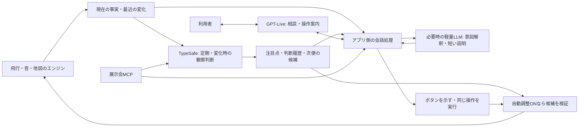

# AI管制官・MCP・操作案内 — 先行する体験と費用

2026-09-18 / **体験仕様・段階別の実装計画・費用の試算。** PCの通常画面にはGPT-Liveの操作ツールとTypeSafeの観察を接続済み。実装・検証の詳細は[現在の機能と確認範囲](ai-web-trial.md)。XR内のAI案内と展示会MCPの画面統合はこれから。

最新の役割分担は **GPT-Live＝人の相談・操作のアシスト、TypeSafe＝人の会話とは独立した飛行状況の観察・判断**。状況はアプリが継続して記録し、TypeSafeへ短い間隔と変化時に渡す。声を閉じても観察は続けられる。「常に観察する」「常に発話する」「設定を自動変更する」は別の機能として扱う。

**AI部分の今回の整理は仕様のみ。** 利用者から「案内されても触る場所が分かりにくい」と報告があったため、以下の第0節にメニュー・強調表示・音声と手操作の協調をまとめた。AIの実装変更・有料APIの追加利用は行わない。複数Questの位置合わせは別途実装を進める。既存の接続設計は[実装計画・UI確認](ai-implementation-plan.md)を参照。Liveは常時ONにせず、本人が開始する。

## 0. 次に作る体験：空を一緒に見て、必要なときだけ手を貸す

**2026-09-18の追加方針：** 展示での音声操作はVR／ARのQuest内メニューを主な体験先とする。PCは制作・管理・開発検証を担う。Questのマイクが展示の周囲音から本人の声を拾いやすいという点は利用者の仮説で、集音・誤認識・ハウリングを実地で確認する。AIの現行実装は据え置き、直近は複数Questの共有と現実の位置合わせを進める。以下のAI体験改善はその後に再開する。

**「ジャービスらしさ」は、いまの対象と目的が通じ、頼むと操作場所が見え、実際に変わったことまで分かること。** 装飾や常時実況を増やすことを品質目標にしない。旅客機と音を眺める余白を残す。

以下は採用に向けた設計案であり、現行画面の機能一覧ではない。PCは声＋クリック、VR／ARは声＋指操作を主な入口とし、同じ操作の定義・状態・結果を使う。機体や航路を選ぶ前の準備段階から相談できるようにする。

### 0.1 声で何をするか、画面はどう変わるか

| 利用者の言い方 | AIの役割 | 画面の反応・本人に残す操作 |
| --- | --- | --- |
| 「まだ何も決めていない。まず1機をゆったり眺めたい」 | 飛ばす前の相談。機体・航路・音の候補を現在の設定から組み立てる | 「1機／ゆったりした航路／空全体を聴く」の準備カード。変更候補を示し、声かボタンの「この設定で準備」で下書きへ反映。飛行開始は別に頼める |
| 「何ができる？」「音量はどこ？」 | 操作案内。設定値は変えない | 対応メニューを開く→対象を1つ示す→実操作で完了。短いラベルと説明を対象のそばに置く |
| 「音量を25にして」 | 明確な変更依頼を実行する | 対象の設定値が変わり、「この端末の音量 35→25%」と結果を表示。戻せる変更には「戻す」 |
| 「この機体はいまどこ？」「何機飛んでいる？」 | 最新の確定状態を説明する | 選択中の機体カード／飛行数を表示。向き・距離は質問した端末を基準にする |
| 「この機体を選んで、音を追いたい」 | 対象選択と聴き方をつなぐ | 明示的に指した／選んだ機体を表示。対象が曖昧なら候補を示す。確認なしに別の機体へ切り替えない |
| 「静かに聴きたい。解説は止めて」 | 自動の管制官解説を止める | 解説OFFが分かり、機体の音と手操作は続く。会話終了・マイクミュートとは別操作 |
| 「音を使う展示を探して」 | MCPから展示を探す（後続） | 出典付き候補→詳細→登録済み地点があれば案内候補。未登録の場所へは飛ばさない |

現行PCで接続済みなのは、音量・再生、単体の飛行開始停止、既存機体の選択、聴き方、編集時の機数、設定・実験室への入口。上表の**複数項目の準備カード、取り消しUI、指示対象と声の結び付け、自動解説、MCP案内は追加仕様**。共有画面のAI操作は端末の音・機体情報等までで、部屋全体の設定や予約変更は未接続。実際の音声認識の成功率と使いやすさは別途確認する。

### 0.2 メニューの見やすさと、案内の見やすさを別々に設計する

**メニュー単体：AIなしでも迷わず触れること。** 小さな入口から「飛ばす準備」「聴き方」「見え方・場所」の目的別に進める案とする。機体・航路・音作りの細かな値は準備の中へ置き、階層を開いたら現在地・戻る・閉じるを同じ位置に表示。アイコンだけにせず短い日本語を添える。変更が「自分だけ」「部屋全体」「次の飛行」に作用するかを該当箇所に示す。詳細な名前・並びは次の画面試作で比較する。

**音声案内：話と画面が一対一で対応すること。** 枠だけを足すのではなく、次の順序を共通化する。

1. 本人が案内を求めたら、必要なメニュー／ページを開き、対象を見える場所へ出す。声は描画結果を確認してから、そのラベルを使って案内する。
2. 対象は1つ。太さのある輪郭・小さな指示マーク・「ここ：音量」の文字を併用し、色の違いだけに頼らない。点滅・大きな波紋・全画面の暗転は使わない。
3. 説明は対象の近くに1文。「『音量』を左右に動かします」のように操作まで伝える。AIの会話欄は畳み、対象と指先を隠さない。
4. 本人が操作したら実際の値で完了を判断し、短い結果に置き換える。案内終了・別の操作・対象消失で古い強調を消す。

PCでは対象を見える範囲へスクロールできる。VR／ARでは視点や身体を勝手に回さない。操作盤が視野外なら「操作盤を呼ぶ」の明示的な入口を用意し、本人が呼んだときだけ盤を手前の操作位置へ置く。音声案内だけで見えていないボタンを指示しない。AIによる自動の視点移動と、本人が選ぶ追尾／視点変更は区別する。

声の状態も区別する：「会話OFF」「聞き取り中」「回答を準備中」「話している」「マイクミュート」。操作の「変更待ち／完了／取消／失敗」は別に表示する。「案内を畳む」は会話終了とせず、マイク状態と終了入口を残す。「止めて」だけで対象が不明な場合は、発話を止めた上で飛行・音・会話のどれを止めたいか確認する。

### 0.3 声とクリック／指操作の使い分け・競合

声は目的の相談・状況の質問・大まかな変更、クリック／指は対象の指定・数値の微調整が得意。片方を必須に固定せず、案内の途中から自分で触れるし、途中から「ここまでやって」と頼める。マイクやAIを使わない来場者も通常メニューで同じ設定を変更できる。

| 重なり方 | 仕様案 |
| --- | --- |
| 「音を小さくして」の返答待ちに、本人が音量を動かした | その手操作より前の未適用の音量依頼を失効させる。ネットワークから最後に届いた命令で上書きしない。本人が触った後の新しい明示依頼なら再評価する |
| 音量をドラッグ中に音声で同じ値の変更を頼んだ | 掴んでいる間は値を奪わない。操作を離した後、最新値と依頼を示して適用の意思を確かめる。無関係な質問・操作は並行できる |
| 「この機体」と話しながら指している | 明示選択／指示対象のID・時刻を発話へ結び付ける。対象が複数・古い・消失なら確認。視線・現実カメラを読めるとは仮定しない |
| ピンチと直接タッチが同時に検出された | 同じ操作として1回にまとめる。指を引く前の再押下や追跡復帰直後の誤実行を防ぐ |
| 「戻して」／結果カードの「戻す」 | 自分の直近の可逆な変更を対象にする。その後の本人・他者の編集を上書きしない。飛行済みの時間は巻き戻さず、下書き／次便など戻せる範囲を示す |
| 共有部屋で変更を頼んだ | 端末だけの変更と部屋全体の変更を分ける。共有編集は権限と設定の版を検査し、サーバーから反映結果が届いて初めて完了とする |

指示には「対象・項目・依頼時点の設定・適用先・実行結果」を持たせる。同じ会話中の希望は保持するが、ページ移動・機体変更・権限変更後も無条件に使い回さない。これは衝突制御の追加仕様であり、現行の重複排除・期限切れ検査だけで完成とはしない。

### 0.4 TypeSafeの判断を体験へつなぐ

**エンジンが事実を計算 → TypeSafeが注目点を選ぶ → アプリが届け方を決める。** 管制官らしさは、数を読むだけでなく「今なぜ注目すると面白いか」「次に何を選べるか」を短く示すことで作る。

| 根拠になる事実・変化 | 注目点の例 | 活かす機能 |
| --- | --- | --- |
| 実際に飛行中の機体数が増えた | 「今は3機が飛行中です」 | 静かな状況カード。本人が聞いたら音声説明 |
| 自分に対する接近、距離、音の到来 | 「ST-02が近づいています」 | 対象カード、「機体を見る」「音を追う」。今も成立するか表示前に再検査 |
| 自分の位置で複数機の音が重なる（特徴量の追加が必要） | 「音が重なる場面です。1機ずつ聴くこともできます」 | 聴き方の案内。利用者の依頼で変更し、観察だけではミックスを変えない |
| 発進間隔や航路設定の比較（後続） | 「次の便の間隔を空ける候補」 | 次便の提案カード。確定した飛行へ遅れた判断を適用しない |

届け方は4つに分ける：**注目点のカード／任意の管制官解説／GPT-Liveの相談文脈／次の設定候補**。まず現在のカードと会話への文脈を充実させ、解説ONで短い読み上げ、最後に条件付きの自動調整を検討する。TypeSafeの出力をそのまま無制限に読み上げない。

「混んでいます」は曖昧なので、最初は「3機飛行中」「2機の音が重なっています」のように根拠を言う。空域の混雑を扱うなら、機数・発進間隔・どの位置での音の重なりか等の定義を別途置く。会場の人混み・実際の事故リスクを把握した発言にしない。内部の音声信号と本人の聴感、音色・音の文法の解釈も別で、現在は波形を聴いて意味を理解する実装ではない。

自動解説は初期OFF。ONでも同じ出来事を繰り返さず、利用者が話す・手で操作する・飛行音を聴く見どころでは字幕に留める。優先は本人の発話／明示操作→必要な操作結果→任意の実況。遅れて届いた接近メモは現在の事実と照合し、通過後に「まもなく接近」と読まない。会話OFFなら文字へ残し、有料の音声接続を勝手に開始しない。

部屋で共通なのは機体・便・航路の状態。距離・左右・音の重なりは各端末で違うため、同じメモを全員に「あなたの右」と読まない。最新の事実・取得時刻・注目の理由を声のAIへ渡し、観察更新待ちで本人の質問を止めない。飛行や衝突回避の毎フレーム制御は引き続きエンジン側が担う。

### 0.5 次の試作と確認の順番

以下はAIを改善するときの工程。直近の開発は[複数Questの位置合わせ](table-alignment.md)を先行する。PCでの準備・自動検証を続けつつ、展示での音声体験の受入先はQuestとする。

1. **PCのメニュー＋対象の案内**：AIを使わず音量へ辿り着けるか、案内後に探し直さず触れるかを別々に確認。まず音量と機体選択で揃える。
2. **飛ばす前の相談と結果表示**：まだ飛んでいない状態から相談→下書き→本人が微調整→飛行。適用先・変更前後・取消を示す。
3. **XRの同じ案内と声／指の協調**：同じ操作IDを空間内の表示・入力に接続してから、Questで文字・対象の見つけやすさ・腕の負担・競合を確かめる。
4. **管制官の気づき**：会話を邪魔しないカード→任意の解説→MCPの展示紹介へ進める。自動調整は別段階。

今すぐのQuest確認は、既存メニューでの文字の読みやすさ・選択・見失った盤への復帰を対象にする。**XR内の音声ツール・AI強調表示は未接続なので、以下の完成判定は接続後に行う。** 既存のコントローラー経路と、新しい指操作の試作入口も分けて記録する。

| 完成判定の場面 | 見たい結果 |
| --- | --- |
| 無音声で「音量を変える」 | メニューの言葉だけで目的へ辿り着き、戻れる |
| 「音量の場所を教えて」 | 音声と同名の対象が見え、値は勝手に変わらない |
| 「25にして」 | 対象と値が変わり、反映後に完了が出る。失敗は失敗と分かる |
| 返答待ちに自分でスライダーを動かす | 遅いAI応答が本人の操作を上書きしない |
| 飛ばす前に相談し、声→指→声と切り替える | 対象・下書き・本人の希望がつながり、飛行開始を別に選べる |
| 通過音を聴く／AIが失敗する／マイクを使わない | 観察と通常操作が続く。任意の解説が主役の音を邪魔しない |

テスト記録は操作成功だけでなく「探した場所」「迷ったラベル」「対象を隠した表示」「音声と画面のずれ」を残す。基礎メニューの迷いをAIの長い説明で補う設計にはしない。

### 0.6 TypeSafeへ渡す「その瞬間のコンテキスト」の拡充案

利用者は、機数・距離だけでなく、傾き・飛び方・空気や空間の条件を豊富に渡し、GPT-Liveの状況説明を助ける使い方を希望。今回このデータ拡充は設計として残し、AI呼び出しや現行の観察ループは変更しない。

| 情報のまとまり | 渡したい値と関係 | 事実として扱う条件 |
| --- | --- | --- |
| 機体と飛行姿勢 | 機体ID、寸法、位置・速度、旋回の傾き、上昇下降、旋回中か、姿勢変化の傾向 | エンジンの現在値と算出値を区別。実機の空力測定値とは呼ばない |
| 飛行条件 | 航路、便の段階、目標速度・高度、周回の変化、直前の編集 | 設定値と実際の挙動を分け、便IDと設定の版を添える |
| 空気・空間条件 | 設定した風・気象・音速条件、机・会場座標、表示の縮尺・校正状況 | 未実装・未測定の値は「未取得」。現実の空気や障害物をセンシングしたと扱わない |
| 機体どうしの関係 | 同時飛行数、相対距離・接近速度、予測した最接近時刻・距離、機体の大きさ | 接近判定はコードで計算し、予測区間と前提を明記。「衝突確定」と短絡しない |
| 観察者にとっての出来事 | 視点からの方向・距離、届く音、重なり、選択機、直前から変わった点 | 本人の端末を基準とする。音量信号と実際の聴感を区別 |

「現在値＋短い時間窓の変化＋機体間の関係」を一組にし、時刻・単位・取得元・未取得項目を持たせる。豊富な情報はアプリ側で保持し、判断時には質問に関係する対象と重要イベントを構造化して渡す。毎フレームの全ログ送信は観察の質・遅延・費用を比較してから検討する。

例えばエンジンが最接近の候補を検出→TypeSafeが他の注目点と比較→GPT-Liveへ「2機が接近する予測。対象・方向・時刻・根拠」を渡す。Liveは「右側の2機に注目できます」と説明する、または条件付きで管制官の注意へ使う。飛行の制約・成立判定はエンジン側で継続し、AIの応答待ちを回避動作の前提にしない。

## 1. 今回変えた優先順位

ユーザーの追加指示により、**AI・MCP・会話と操作案内を先行する。複数Questの校正・実機試験を着手条件にしない。** 最初はPC、最終的にQuest 1台でも楽しめる体験を目指す。既存のマルチを撤去する意味ではなく、2台の実物との一致は機材が使えるときに再開する。

最初の到達点は「いま何が起きているかを聞ける」「押す場所を教えてもらえる」「会話でもボタンでも操作できる」「展示を探して紹介してもらえる」。会場内の実寸案内飛行と、部屋一覧・VRロビー全体は初回の必須条件から外す。

この仕様はCloudflare側へAPIの窓口を追加する前提。Quest単体とはヘッドセット1台で体験できる意味であり、クラウドAIのオフライン動作ではない。部屋参加は必須にせず、単体の飛行状態を渡す構成も用意する。

## 2. 操作イメージ

通常は空と旅客機を眺め、下のバーに「メニュー」「音」「管制官」。管制官を開いたときだけ短いカードを出す。

```text
管制官                         [閉じる]
いま：ST-01が飛行中 ／ あとから音が届きます

[ いまの様子を聞く ] [ 操作を教えて ]
[ 飛び方を相談する ] [ 展示を探す   ]

        [ 話しかける ]   [文字で相談]
```

会話中はマイク状態と「会話を終える」を表示。文字での相談・ボタンは常に残す。「音を止める」と「会話を終える」を別にし、音声接続が続いているか分かるようにする。

### 例A：押す場所を案内する

1. 利用者：「音を少し大きくしたい。どこを押すの？」
2. 管制官：「『聴き方』を開いてみてください」。対応するボタンの縁とラベルを控えめに強調する。
3. 利用者が押したことをアプリの操作イベントで確認する。
4. 次に「音を大きくする」を示す。本人の操作で音量が変わったら「音量が上がりました」と短く表示する。
5. 案内を閉じると強調を消し、空へ戻る。

スクリーンショットの座標を推測して押す方式にはしない。既存の操作ID `menu.sound` → `sound.louder` を使い、PCのDOM・XRの盤それぞれで同じ対象を示す。メニューが閉じている場合はバーを示す。利用者が案内を開始した状態なら必要なページを開く補助も可能にする。

### 例B：会話から動かす

「音を少し大きくして」なら案内ではなく操作の依頼。端末内の音量変更は既存の許可範囲で実行し、変更後の値と「戻す」を出す。機体・航路の変更は短いプレビューへ。初期案は「この設定で試す／戻す」で採用する。自動変化を有効にした試験では、指定範囲の次周設定を自動適用して比較する。

「教えて」と「やって」を区別する。部屋全体の操作には実際の編集権限・対象・版を適用する。取り消せない完了済みの飛行に「元に戻した」と返さず、取り消せる下書きや次便を明示する。

### 例C：展示を探す

「音を使う展示はある？」→展示会MCPで検索→2〜3件の紹介カードと出典→気になる展示の詳細。ここまでなら会場測量・2台同期なしで試せる。

MCPのブース番号・地図リンクから、仮想空間のm座標を推測しない。将来の `exhibitId → venuePointId` 対応付けがあるときだけ飛行候補にできる。位置未登録なら「展示の紹介・地図を開く」までを案内する。

## 3. 自動案内の振る舞い

| きっかけ | 出すもの | 終える条件 |
| --- | --- | --- |
| 初回入場 | 「メニューから操作できます」の短い1回の案内 | 閉じる・最初の操作。再表示は任意 |
| 「操作を教えて」／案内ON中に操作が止まった | 今の画面で押せる対象を1つだけ示す | 押した・別操作・案内終了 |
| 必要な前提が未成立 | 「先に音を有効にします」など、実際の状態に合う説明 | 前提が成立、または中止 |
| 会話・MCPが待機／失敗 | 文字で待機・再試行・手動の選択肢 | 完了・取消。飛行と音は継続 |
| 空を眺めている | 原則として表示と発話を増やさない | 利用者が呼ぶ、または明示した案内条件 |

無操作は「困っている」と断定しない。案内ON中のみ待機時間を使い、同じ案内は繰り返さない。初期案は一度に1文・1対象、点滅なし、カメラの強制移動なし。操作中・音の見どころでは自動発話を控える。案内の頻度・声は利用者がOFFにできる。

**自動でボタンを示す部分は、毎回AIを呼ぶ必要がない。** 状態と操作IDを使うローカルの案内が基本で、言い換え、依頼の解釈、展示紹介、飛び方の相談へAIを使う。費用が尽きても基本案内とボタンを維持する。

## 4. 人と空間の、別々の時間軸で動く構成



- **状態**：単体／共有、飛行中／準備中／音の到来待ち、選択機、設定と実測の区別、音量、開いているページ、接続状態、現在使える操作ID。共有では部屋の版と権限も持つ。
- **案内**：`targetActionId`、短い説明、必要なページ、前提条件、完了イベント、有効期限。対象が消えた／ページや権限が変わったら破棄・再評価。
- **操作**：案内と実行を分ける。実行結果を受け取って初めて「変更した」と言う。共有操作は既存のサーバー検証、単体はローカルの同じ値検証を通す。
- **声**：押して会話開始、割り込み停止、明示終了・実際のページ終了時の切断を管理。利用者の指定により、試用の回数・時間制限は撤去済み。タブ非表示だけでは切断しない。日本語の文字表示を併用する。Questのマイク許可・ハウリング・周囲音は実機で別確認。
- **知っている範囲**：アプリの状態を読む。周囲の現実映像や利用者の意図が自動で分かるとは扱わず、常時カメラ送信も初回に含めない。
- **TypeSafe**：主役割は飛行状況の観察と有限の選択・評価。会話のたびにGPT-Liveの判断を二重にやり直す構成へ固定しない。注目する出来事、次周の候補、静かに待つ、といった判断を継続する。

モデルに全メニューや全展示の原文を毎回送らない。必要な事実・使える操作・検索結果の短い要約と出典を渡す。部屋の鍵・招待URL・APIキーは送らない。

### 4.1 空間側：観察を続けるTypeSafe

アプリが機体・便・航路・音の到来・予約を整理し、TypeSafeが「今どれに注目するか」を判断する。TypeSafeのJevは自由文を書くモデルではないため、毎回の文章要約を直接任せない。Choiceなどの結果を、元の事実と結び付けた観察メモとして蓄積する。[TypeSafeの質問形式](https://docs.typesafe.ai/introduction)

初回に試すループは次のとおり。間隔は検証用の仮値であり、APIの速度保証ではない。

1. **記録**：エンジンは通常どおり動く。状態の変化をイベントにし、最新状態と直近60秒程度の小さな履歴を保持する。全フレームの姿勢や長いログをAIへ送らない。
2. **観察**：飛行中は原則10秒間隔。周回切替・新しい便・音の到来等で次の判断を前倒しできるが、開始間隔は最短5秒、同時に1件まで。重なった依頼は最新の状態へまとめ、遅れた分を連続再実行しない。
3. **選択**：コードが作った事実付きの候補から1つ選ぶ。例は「ST-01の接近に注目」「前の周回と比較」「次便の候補を準備」「変化なし」。初回は1スナップショットにChoice 1回で費用と質を測る。
4. **記録・共有**：観測時刻・シミュレーション時刻・対象ID・設定の版・根拠イベントID・選択結果・有効期限・モデル版・usageを残す。モデルの判断とエンジンの確定値を別の項目にする。
5. **利用**：会話から読める最新メモを更新する。解説ONのときだけ、重要な変化を短い字幕や声へ。自動調整ONなら、許可した項目・幅・適用時点に限って候補を検証する。

共有空間の後続設計では**部屋ごとに1つの観察処理**をサーバー側で動かし、各Questから重複して推論しない。現行は運営者の観察セッションで、部屋単位への統合は未完。状態更新の途絶では判断を待機させ、再開時に最新の状態を読み直す。推論を待って描画・飛行・音を止めない。将来の無人部屋や予算到達時の停止は運用設計として別に扱い、今回撤去した試用上限を再導入する意味にはしない。

TypeSafeが遅い／失敗した場合は最新の確定事実とローカル案内へ戻る。古い判断には時刻を付け、別の便・編集済み航路に適用しない。設定の版は編集時に変えるものとし、毎フレーム進む時計とは区別する。間隔や接近量の計算、姿勢制御、成立しない航路の拒否はコードが担当する。

同じ空の「便の状態」は共有できる一方、「あなたの右から聞こえる」は端末の位置・向きで違う。方向と音の聞こえ方は各端末が計算し、その利用者の会話へ渡す。全員へ同じ左右の説明を流さない。個別視点にもTypeSafeを呼ぶ場合は追加枠として数える。

### 4.2 人側：GPT-Liveで聞く・分かる・自分で触れる

標準は「こうしてみてください」と一段ずつ対象を示す。本人が押して変わったことを確かめ、慣れたら案内を閉じられる。「変えて」と依頼された場合は同じ操作の代行へ切り替える。観察ONだけで編集の許可を得たとは扱わない。

GPT-Liveには **client delegation** を使用。アプリが会話の文脈・受信済みの状態・TypeSafeの観察結果を集め、軽量LLMと許可された操作を通して返す。MCPは後続。質問時には次のTypeSafe周期を待たず、最新の取得状態を使う設計とし、質問した瞬間の実測値と取り違えないよう取得時刻も扱う。[公式Delegation](https://developers.openai.com/api/docs/guides/live-delegation)

- 「いま何が起きている？」：最新状態＋観察メモから説明。文章生成はGPT-Live自身、または必要時の軽量LLMを使う。定型の操作案内はコードで作れる。別の軽量LLMをすべての観察周期で必ず呼ぶ設計にはしない。
- 「もう少しゆったり飛ばしたい」：軽量LLM等で依頼を既存パラメーターへ整理→プレビューまたは明示した自動範囲へ→検証した結果を返す。
- 解説ON：同じ出来事は繰り返さず、直前の案内・会話・聴きどころを見て発話を間引く。Liveを閉じた状態なら文字メモを更新し、音声を自動で再接続しない。常時実況は別の利用時間・予算設定にする。

実装時の注意：`session.delegation.created`は委譲ID等のメタデータで、依頼本文を含まない。入出力のtranscriptとアプリ状態を保持する。文字起こしの断片だけで操作を確定しない。`session.thinking.append`は内部文脈、`session.commentary.append`は声で伝えたい結果に使い分ける。appendの受領は操作完了や聞こえた証拠ではない。古い依頼の取消・世代管理はアプリが行う。Realtimeのfunction tool APIと混同しない。

### 4.3 地図側への展開

| 対象 | アプリ／MCPが持つ事実 | TypeSafeの判断案 | GPT-Liveの役割 |
| --- | --- | --- | --- |
| 仮想マップ | 機体、現在便、登録地点、候補航路 | 次に注目する地点／次便の候補を選ぶ | 「どこを見ると面白いか」を説明し、表示操作を案内 |
| 展示会マップ | MCPの展示内容・ブース番号、登録した地点対応 | 来場者の興味に合う候補、現在地点から紹介する展示を選ぶ | 展示の説明、地図を開く／選ぶ操作を支援 |
| 実寸AR | 実測点、校正結果、図面とm座標の対応 | 成立する行き先候補の優先度を選ぶ | 登録済みの範囲を説明。未登録の位置を推測しない |

MCPの取得とTypeSafeの観察を同じ10秒周期にしない。展示データは短くキャッシュし、検索依頼や更新時に取得する。距離・座標変換・航路の計算はアプリ側で行う。会場図だけから人の混雑や空いている通路が分かるとは扱わない。

## 5. MCPの確認結果と組み込み方

2026-09-18、`https://mcp.genai-expo.com/mcp`へ読み取りのHTTP検証を実施。`initialize`・`tools/list`、開催情報、ゲーム分野の検索1件、その展示詳細の取得に成功。アプリ内への接続やCodex全体の設定追加は行っていない。証拠は `output/ai-spec/expo-mcp-probe.json`。

| 実際のツール | 初回の用途 |
| --- | --- |
| `get_event_info` | 開催概要・検索用ジャンルを取得 |
| `search_exhibits` | キーワード／ジャンル／展示形式で候補を取得 |
| `get_exhibit` | 既知の展示IDから詳細・ブース番号・地図リンクを取得 |

認証不要・読み取り専用のStreamable HTTP接続。結果に `sourceUrl`、`dataAsOf`、`mapRevision` があり、`datasetVersion` 等はnullも返る。確認した詳細スキーマに実測m座標はない。公開資料では5分ごとの更新と一時的なアクセス制限を案内している。[展示会MCP公式](https://www.genai-expo.com/mcp)

アプリではサーバー側の接続処理を介し、検索条件と結果を整形する。同じ検索は短くキャッシュし、取得時刻・古い情報であることを表示。中断・失敗で飛行を止めない。展示紹介は外部の説明文として扱い、含まれる操作指示でツールや権限を変えない。MCPの検索結果そのものから飛行開始を実行しない。

## 6. GPT-Live＋独立したTypeSafe観察の費用

**2026-09-18の公式料金で試算。日本からの実利用・遅延・日本語品質は未測定。** 円換算は計画用に **1ドル＝160円** と置いた。実際の為替ではない。新規登録の無料クレジット、キャッシュ割引を差し引かず比較する。

| 構成要素 | 試算単価 |
| --- | --- |
| GPT-Live 1 | 音声セッション$0.05/分。裏で動く判断モデル・ツールは別 |
| 必要時のテキストモデル `gpt-4.1-mini` | 100万token：入力$0.40／出力$1.60。試算用の基準であり採用確定ではない |
| TypeSafe `jev-1.13.0` | 入力100万tokenあたり$0.042、出力無料 |

根拠：[OpenAI料金](https://developers.openai.com/api/docs/pricing)、[Liveの課金](https://developers.openai.com/api/docs/guides/voice-latency-cost?api=live)、[TypeSafe料金](https://docs.typesafe.ai/models)。GPT-Liveが音声の入出力を担当するため、主案には別の文字起こし／Aivis読み上げを足していない。以前のRealtime・Aivis比較は計算結果の `historicalPerConversationComparisons` と進捗履歴へ残した。以前のTypeSafe料金は会話3回分のみで、今回の継続観察とは前提が違う。

### 共通の利用仮定

- GPT-Liveは1会話90秒。無言・操作・裏処理待ちも接続時間に含める。短い会話を終了して区切る仮定であり、8時間ずっと履歴を増やす会話ではない。
- 任意の軽量LLMは1会話3回、基本入力2,000テキストtoken／出力120token。前の出力も再入力し、合計入力6,360／出力360token。実際の指示・状態・ツール情報がこの入力枠を超えたり、応答が増えたりすれば増額する。
- TypeSafeは会話数ではなく**独立した空間の稼働時間**で計算。1空間10秒間隔、1周期1回、入力1,000token。入力には指示・候補・状態を含む。複数の質問や視点別判断を呼ぶ場合は別に加算する。
- 計画額は算定額の2倍を100円単位で切り上げた予備込み。**2倍なら必ず収まるという保証や、課金停止の上限ではない。** 長い履歴、追加応答、再接続、話す量は実測後に置き換える。

### 100人×90秒の会話 ＋ 1空間を8時間観察

| 内訳 | 計算 | 算定額 |
| --- | --- | ---: |
| GPT-Live | 150分 × $0.05 × 160円 | 1,200円 |
| 必要時の軽量LLM | 上記3応答 × 100会話 | 約50円 |
| TypeSafeの観察 | 2,880回 × 1,000入力token × $0.042/100万 × 160円 | 約19円 |
| 合計 | 軽量LLMを含める | **約1,269円** |
| 予備込み計画額 | 合計を2倍、100円単位で切り上げ | **約2,600円** |

事実・定型文をそのままGPT-Liveへ渡し、別のテキストモデルを使わない場合は約1,219円、計画額約2,500円。どちらもLive音声は有料。AIなしのボタンと定型案内だけなら追加AI料金0円だが、自由な音声対話を含まない。

### ミニマムから多用時まで

下表はGPT-Live、会話に伴う軽量LLM、TypeSafe観察の合計。音声の台数と、観察する空間の数を分ける。

| 利用量 | 算定額 | 予備込み計画額 |
| --- | ---: | ---: |
| 小さく試す：20人×90秒、1空間を1時間観察 | 約252円 | 約600円 |
| 展示の基準：100人×90秒、1空間を8時間観察 | 約1,269円 | 約2,600円 |
| 多用例：1台で8時間分の会話、1空間を8時間観察 | 約4,019円 | 約8,100円 |
| 4台で各8時間分の会話、同じ1空間を観察 | 約16,018円 | 約32,100円 |
| 4台で各8時間分の会話、別々の4空間を観察 | 約16,076円 | 約32,200円 |

**費用を左右するのは主に声をつないでいる時間。** 100人が各3分つなぐと、観察8時間＋軽量LLM3応答の同じ条件で約2,469円／計画額約5,000円。各5分なら約4,069円／計画額約8,200円。応答数を固定して接続時間だけの違いを比べた値で、会話が長くなって応答が増える分は別。

100人×5分は合計500分なので、1台・8時間には収まらない。この比較を実際に運用するなら複数台または時間延長が必要。時間を延ばす場合は観察時間も増やして再計算する。

操作を練習する間は強調表示を残して会話を終え、「続きを聞く」で再開する流れも用意する。マイクミュートだけでは課金時間は終わらない。WebRTC初期化15秒分は開始後の利用へ充当されるため、正常な90秒会話に15秒を二重加算しない。短すぎる開始・失敗・再接続は追加費用になり得る。[公式の課金](https://developers.openai.com/api/docs/guides/voice-latency-cost?api=live)

### TypeSafeだけを継続して動かす費用

| 1空間・8時間、1回1,000入力token | 回数 | TypeSafeの算定額 |
| --- | ---: | ---: |
| 30秒間隔 | 960回 | 約6.45円 |
| 10秒間隔（初回案） | 2,880回 | 約19.35円 |
| 5秒間隔（前倒しが続いた場合） | 5,760回 | 約38.71円 |

「常時観察」はこの独立したループで実現できる見込み。声を8時間つなぐ必要はない。ただしAPIの日本語精度・応答時間・契約上のレート制限は実測が必要。毎回2つの独立した質問を呼べばTypeSafe料金も2倍。これは推論料金だけで、サーバー稼働等は下記の別枠。

軽量LLMにも10秒ごとに説明を書かせる比較では、1回入力2,000／出力120tokenとして観察と合わせ約476円/8時間になる。初回案は観察メモを型付きの判断として保持し、人が聞く／解説ONの見どころで文章化する。連続した文章の観測日誌が必要になったら、文章化の間隔を別に設定する。

### 合計へ別途含めるもの

- Cloudflare：現行Free枠内なら追加0円。AI接続を含む実際のCPU・接続時間・Durable Objectsの使用量は未測定。Free超過では処理が失敗するため、無料で無制限には扱わない。有料へ移るなら最低$5/月（仮換算800円）＋超過分で、1日だけの$5/30としては見積もらない。[Workers料金](https://developers.cloudflare.com/workers/platform/pricing/) / [Durable Objects料金](https://developers.cloudflare.com/durable-objects/platform/pricing/)
- 展示会MCP：認証なしの公開読取は今回成功。利用料金の記載は確認できず、初期試算では0円と仮置き。将来の有料MCP・外部検索・追加サービスは別に計上する。
- 開発中の比較呼び出し、ドル建てサービスの税・為替手数料、声／素材の利用条件による費用。Aivisの表記だけは税込。

再計算：`node scripts/estimate-ai-cost.mjs --out docs/ai-cost-estimate.json`。ネット接続も課金も行わない計算スクリプト。[計算結果](ai-cost-estimate.json)。

## 7. 「最大額」を制御する仕様案

**以下は上限撤去前の運用候補を残したもの。採用済みの制限ではない。** 現在は利用者の指示でアプリの回数・会話時間・試用期限を撤去済み。費用は発生し得るが、通貨ベースの予算台帳は未実装。今後この案を使う場合は運用方針を改めて決める。

利用時間・呼び出し回数が無制限なら有限の最大額は置けない。上の多用例と、サービスが止める予算上限を分ける。

**当初の運用候補：最初の検証は1日1,000円、展示は1日5,000円。ユーザーの確定予算ではなく未設定。** 90秒は費用試算用の会話時間で、現在の終了タイマーではない。有料接続の検証履歴は[確認記録](ai-web-trial.md)を参照。

1. 開催期間・日次枠・会話枠をサーバーが管理。APIキーはサーバー側、音声接続は短命の権限で開始する。
2. 呼び出す前に残予算から見込み枠を確保し、実usageで精算。同時処理が同じ残額を使い切らないよう一つの台帳で判定する。音声時間、応答回数、入力・出力token、MCP・TypeSafeの回数を制限する。
3. 利用者の終了・時間切れ・切断で、サーバー側でも音声終了を管理する。端末側タイマーやマイクミュートだけに依存しない。Liveは`session.close`後の`session.closed`と最終usageを確認して精算。`session.usage.updated`の秒数は累積なので、足し込まず最新値に置き換える。終了確認が取れない分の確保枠は解放せず調査対象にする。バックエンドの取消は音声終了とは別に処理する。[終了とusage](https://developers.openai.com/api/docs/guides/live-conversations#usage-and-graceful-close)
4. 予算が少なくなったら文字案内へ。到達時は新規の有料処理を止め、飛行・ボタン・定型案内を継続する。別の有料モデルへ自動退避しない。
5. OpenAIの専用プロジェクトにも月次hard spend limitを設定する候補。**反映は瞬時ではなく少額超過があり得る**ため、アプリの日次枠と余裕を併用する。OpenAIの上限ではAivis・TypeSafeの費用は止まらない。[公式Spend limits](https://developers.openai.com/api/docs/guides/spend-limits)

モデルの返答にusageがない／集計できない場合は安いとみなさず確保枠を維持する。推論の自動再試行は初回なし。MCPの読み取り失敗は利用者へ再試行を示す。利用量と費用は運営側に表示し、来場者の空を料金表示で埋めない。

観察は独立した枠として、初回は1空間・8時間・1質問・最大5,760回（最短5秒）を提案する。音声を閉じても観察は残るが、空間の終了・無人・状態不明・観察枠の到達で停止する。音声枠を使い切ったからといって、残っているTypeSafe枠から勝手に音声へ振り替えない。各枠と合計枠の両方を検査する。

## 8. これからの実装単位と受入

| 順序 | 作るもの | PCで先に確認すること |
| --- | --- | --- |
| A | 状況スナップショット、共通操作、案内対象の強調 | 状況を捏造しない、正しいボタンを示す、本人が押すと次へ、閉じると消える。手入力／XR描画は模擬でも確認 |
| B | TypeSafeの独立観察、判断メモ、観察の予算枠 | 会話なしで周期が進む、同じ部屋は1回だけ、遅い返答を破棄、最新状態へまとめる、無人・停止で終了。まず変更は実行せず観察で比較 |
| C | GPT-Liveのclient delegation、会話の予算枠 | 状況メモ＋最新事実で返答、案内／代行を区別。割り込み・最終usage・待ち時間・実費。会話終了後も観察だけ継続 |
| D | 展示会MCPのアプリ内接続と紹介カード | 検索→詳細→出典、遅延・空結果・通信断・古い結果。最初の2つのAI試用の着手条件にはしない |
| E | 許可した範囲の自動調整と必要時の文章化 | 次周等1判断から検証・適用・記録。止める／戻す、本人の編集を上書きしない、会話と自律動作の競合を扱う |
| 後で | Quest単体、さらに2台の実機受入 | 単体のマイク・手・文字・音から確認。複数台の校正・会場飛行は別工程で再開 |

AはPC通常画面の操作接続と基本の強調表示、BはTypeSafeの独立観察、CはLiveの会話とツール委譲まで実装あり。ただし、B／Cの通貨予算、部屋単位の観察統合、XR内のAI案内、DのMCP統合、Eの自動調整は未完。実マイクでの操作の認識と分かりやすさも別確認。次の体験改善と受入は第0節を基準にし、過去の自動検証を使いやすさの合格と扱わない。
