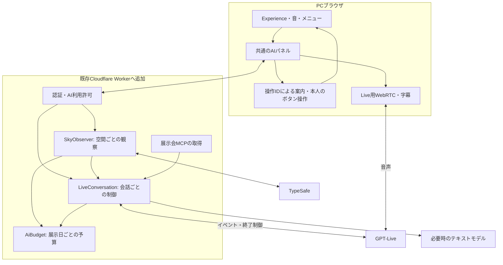

# GPT-LiveとTypeSafe — 実装する場所・Webで試す順序

2026-09-18 / 現行コードとPCメニューを確認した実装計画。**追記：Cloudflareに運営者用の単体PC試用を実装・配置し、GPT-Live、TypeSafe観察、文字相談の実接続を確認した。** 実際の配置・試用制限の撤去・未確認範囲は[Web試用の記録](ai-web-trial.md)を参照。本書の`SkyObserver`等の分離構成と通貨ベースの予算台帳は後続設計であり、そのまま実装済みとは扱わない。

体験と費用の根拠は[AI管制官の仕様](ai-guide-spec.md)、全体の状況は[進捗](progress-overview.md)へ集約する。

## 1. 今回の入口と実装方針

- **最初はPCブラウザ、Cloudflare上で試す。** `?ui=components&ai=trial` のメニュー試作に2つのAIを接続。Questや2台同期は着手条件にしない。以下の設計表は本体・共有版へ広げる計画で、初回試用との差分は[Web試用の記録](ai-web-trial.md)へ。
- **GPT-Liveは「会話を始める」から「会話を終える」まで継続対話。** 初期状態は未接続。9月18日の指示で試用回数・会話時間・試用期限は撤去。ページを開く、観察をONにする、メニューを開く、ガイドを始める操作ではマイク取得・Liveセッション作成をしない。押し続ける操作は不要。
- **TypeSafeは空間を観察する独立した処理。** 有効期間中、飛行状態・音の到来・次便等の注目点を選び、メモを更新する。会話が終わっても観察は継続可能。
- **操作を覚えるための案内を基本にする。** 「押す場所を教えて」と「代わりに変えて」を区別し、利用者がボタンで同じ変更をできる状態を保つ。
- Reactから直接各社へ秘密キー付きのリクエストを送らない。API窓口は既存Cloudflare Workerへ追加する。新しいフロントエンドやAgents SDK一式の導入は初回の前提にしない。

## 2. 今あるものと不足しているもの

| 現在の実装 | 再利用する部分 | 追加が必要な部分 |
| --- | --- | --- |
| `apps/desktop/src/ControlLab.tsx` | 実際の飛行エンジン、音量、メニュー状態、AI試用パネルを持つPC試作 | 共有部屋の読み書きと利用権限への接続 |
| `apps/desktop/src/ui/control-menu.ts` | 操作ID、日本語、説明、使用不可の理由 | 表示中の操作一覧、実行結果、案内手順の契約。現在のscopeはdeviceのみ |
| `apps/desktop/src/ui/ControlDock.tsx` | 日本語付きボタン、DOMの`data-action`、開閉 | 今回、対象の強調と案内カードを追加。モデル用に可視・使用可否の情報も渡す |
| `apps/desktop/src/ui/control-guide.ts` | **今回新設**。状態から次に示す操作を選ぶ | 現在は音量変更のみ。飛行開始・選択解除などへ増やす |
| `packages/core/src/room-observation.ts` | 部屋の飛行中／到来待ち／予約／下書きを区別 | 単体版との共通スナップショット、注目点候補、短い変化履歴 |
| `workers/typesafe-intent.ts` / `packages/core/src/ai-intent.ts` | サーバーでのHTTP接続、型・応答の検証、期限切れの扱い | 現在は利用者の言葉を音操作6択へ分ける試作。飛行観察用の質問は別に作る |
| `workers/room-worker.ts` | Worker入口、部屋の認証、編集権限、サーバー時計、運営者用AIルート | 複数利用者のAI権限と金額予算。限定試用は別のSecretと回数制限で保護 |
| `apps/desktop/src/SharedApp.tsx` / `RoomTower.tsx` | 共有画面の状況欄と定型案内 | 検証後に共通のAIパネルを組み込む。現行UIと新しいバーはまだ別 |
| `apps/desktop/src/room-client.ts` | 共有操作のID・版、ack／rejected | 操作の成功・失敗を案内へ返す。`send()`を呼んだだけで成功と言わない |
| `apps/desktop/vite.config.ts` | `/api`をローカルWorkerの8787へ転送済み | 同じ窓口をAIにも使う。別の開発サーバーを増やさない |

`observeRoom`の速度・高度は設定値で、現在位置の測定値ではない。接近・左右・聞こえ方を説明する場合は、Experience等で計算した時刻付きの値を追加する。まだ計算していない事実は候補に含めない。

## 3. 配置図

音声はブラウザとOpenAIのWebRTCで送受信する。Cloudflareは接続開始・会話の文脈・操作・予算・終了を担当する。TypeSafe観察にはマイクの音声を渡さない。

## 4. TypeSafeの実装方法

### 新設する場所

| 新設先（予定） | 責務 |
| --- | --- |
| `packages/core/src/flight-observation.ts` | 単体／共有の事実を共通形式へ変換。`worldRevision`、便ID、観測時刻、観察候補を持つ |
| `packages/core/src/observation-decision.ts` | 1質問のChoiceを作り、返答を検証。根拠イベントID、期限、モデル版を添える |
| `workers/typesafe-client.ts` | 既存接続処理を共通化。timeout・HTTP状態・usageを扱う。自動再試行なし |
| `workers/sky-observer.ts` | 空間ごとに1つのDurable Object。10秒周期、前倒し時も最短5秒、同時1件、最新状態への集約 |
| `apps/desktop/src/ai/observation-client.ts` | 単体状態の送信、観察メモ・停止理由の取得。複数端末で同じ観察を二重起動しない |

初回の候補は「現在の便に注目」「音の到来に注目」「次便に注目」「変化なし」。測定値を整えてから、接近・周回の比較・音の違いへ広げる。返却されたChoiceを、コードが保持する事実と日本語の短いカードへ変換する。TypeSafeに自由な解説文の生成を期待しない。[HTTP API](https://docs.typesafe.ai/api)

### 部屋の既存タイマーを使い回さない理由

`SkyRoom.alarm()`は部屋の終了と次便の自動準備に使われている。Durable Objectのalarmは1つで、新しい`setAlarm`は前の予定を置き換える。そこで観察は**別のSkyObserver**に置く。alarmは少なくとも1回実行で再実行され得るため、周期IDと送信済み記録で同じ有料推論を重ねない。送信後に結果不明になった周期は、自動再送せず未確定として記録する。[Cloudflare Alarms](https://developers.cloudflare.com/durable-objects/api/alarms/)

共有状態は内部RPCで`SkyRoom`から秘密情報を除いた観測だけ読む。単体は期限付きの観察IDに対して最新状態を送る。ブラウザのタイマーは状態送信用に使い、課金周期の主導権はサーバーに置く。無人・終了・停止・状態が古い・予算到達で観察を止める。

API案（すべて新設予定）：

- `POST /api/ai/observers`：許可された空間の観察を開始。既存IDなら二重開始しない。
- `PUT /api/ai/observers/:id/snapshot`：単体版の状態更新。共有はサーバーの確定状態を使う。
- `GET /api/ai/observers/:id`：状態・最新メモ・観測時刻を取得。
- `DELETE /api/ai/observers/:id`：観察を停止。飛行そのものは止めない。

IDを知っているだけでは操作できず、利用者と空間に結び付いた許可を毎回確認する。

## 5. GPT-Liveの実装方法

### 新設する場所

| 新設先（予定） | 責務 |
| --- | --- |
| `apps/desktop/src/ai/live-client.ts` | 利用者が押してマイク開始、WebRTC、字幕、接続状態、終了・失敗時の片付け |
| `apps/desktop/src/ai/AiPanel.tsx` | 「話しかける」「会話を終える」「操作を教えて」、今の注目点、文字相談 |
| `workers/live-session.ts` | サーバーの固定設定で`gpt-live-1`＋client delegationのセッションを作る |
| `workers/live-conversation.ts` | 会話ごとのDurable Object。sideband、文脈、委譲、期限、終了とusageの確定 |
| `workers/ai-assistant.ts` | 最新事実・観察メモ・可視メニューを読み、必要時に軽量LLM/MCPへ接続。案内と実行を区別 |
| `workers/ai-budget.ts` | 展示日等の単位で予算を確保・精算。同じ残額を複数会話へ二重に割り当てない |

ブラウザの「話しかける」からSDP offerを自分たちのAPIへ送る。サーバーが`POST /v1/live/sessions`へ接続し、返された`session.id`と`transport.sdp`で開始する。`session.started`を待ち、データチャネルから重ねて`session.start`を送らない。公式はHTTPSまたはlocalhostとマイク許可を前提にしている。[OpenAI WebRTC](https://developers.openai.com/api/docs/guides/voice-webrtc?api=live)

会話のサーバー制御には`wss://api.openai.com/v1/live/sessions/{session_id}/attach`を使う設計。ブラウザとサーバーが同じイベントを受けても、委譲の実行はサーバー1か所が所有する。音声やAPIキーを部屋へ配信しない。サーバーにも音声イベントが届き得るため、初回は音声ペイロードを保存せず破棄する。[公式Server-side controls](https://developers.openai.com/api/docs/guides/voice-server-controls?api=live)

**技術確認の結果**：Cloudflareの標準APIでLiveのsideband接続と`session.close`→`session.closed`、利用秒数を確認した。OpenAI SDKは導入せずREST／WebSocketを使用。実マイクの往復と90秒通しの確認は残る。展示公開向けの複数利用者・金額予算は後続。

API案（新設予定）：

- `GET /api/ai/status`：機能が使えるかを取得。秘密や残高の詳細は来場者へ返さない。
- `POST /api/ai/live/sessions`：権限・残枠・同時数を確認し、セッションを作る。再送IDで二重作成を抑止。
- `POST /api/ai/live/sessions/:id/context`：その人に見えている操作・端末状態を送る。共有の事実や権限はサーバーで再確認。
- `POST /api/ai/live/sessions/:id/close`：サーバーからも終了する。操作の所有者を確認。
- `POST /api/ai/live/sessions/:id/action-results`：端末操作の実結果を通知。共有操作は部屋の確定結果を参照。

会話は初回90秒上限案。終了要求→`session.closed`→最終usageで精算する。通信断時は「終了確認中」とし、結果不明の確保枠を解放しない。sidebandが切れた場合も残った期限で終了を回復させ、勝手に新しい有料会話を作らない。会話終了が観察の停止指示になることはない。

## 6. 案内しやすいUIの確認結果

2026-09-18、ローカル試作の実画面で確認した。

| 気づいた点 | 対応・実装ルール |
| --- | --- |
| 操作IDと日本語ラベルは既にある | 発話と画面の名称を同じ定義から取る。「右下のあれ」等の座標指示を避ける |
| 同じ「音を聴く」が盤とバーの両方にある | `actionId`に`location: panel / dock`を添え、示す場所を1つにする。今回のDOMへ場所属性を追加 |
| メニューは前に見たページから再び開く | 固定手順を読み続けず、必要なら「メニューに戻る」を先に示す。今回のガイドで対応 |
| 押した後に結果が変わったかを確認する必要がある | クリック回数で進めず、実際の音量を確認。音量変更と音の再生開始を言い分ける |
| 上限・音の準備中・Quest限定のボタンは押せない | 可否と理由を会話へ渡す。無効なボタンを押すように案内しない |
| 案内が空や操作を隠す可能性 | 同じメニュー内に短いカード、1対象の枠と「ここ」。点滅・新しい大きな演出は加えない |
| ガイドを閉じることと音声を切ることは違う | 今回の「案内をやめる」は強調を消す。Live導入後は「会話を終える」を接続中ずっと独立表示 |
| 共有版には別のUIが残っている | ローカル試作だけの完成を、本番UI統合の完了としない。共通パネルをApp／SharedAppへ順に適用 |

### 今回追加したWeb試作

入口：`http://127.0.0.1:5173/?ui=components` → **「操作案内を試す」**。

本人が「メニュー → 聴き方 → 音量を上げる」を押す。対象に枠と「ここ」が付き、実際の設定が変わると完了。上限70%から始めた場合は下げる操作で練習する。途中で別のページを開いても見えている操作から案内し直す。案内終了・2分の期限切れで強調を消す。**ローカルの定型ガイドであり、GPT-Liveはまだ話さない。マイク取得・有料API呼び出しはない。**

今回はPCのみ。XRへ入るとこの練習は終了する。次に`SpatialControlMenu`へ同じ対象・短い説明を描く実装を行う。DOMの枠を付けただけでVRの盤にも出るとは扱わない。

### 会話へ渡す操作の契約（次の拡張）

`actionId / label / location / visible / enabled / disabledReason / scope / contextRevision`

案内要求は`guideId / targetActionId / expectedEffect / expiresAt`を持ち、UI側がいま有効か確かめる。部屋や権限が変わったら失効。AIから任意のCSSセレクター、JavaScript、URLを受け取って実行しない。音声を止めた後も希望すれば文字の手順は残せる。

## 7. 実装を進める順番と確認

| 段階 | 作業 | 完了を判断する条件 | 現状 |
| --- | --- | --- | --- |
| 0 | 案内のUIを先に確認 | 1対象を示し、本人の操作と実結果で次へ。閉じる・期限切れ・別ページに対応 | **音量のPC試作まで実装** |
| 1 | 観測と操作の共通形式 | 同じ入力なら同じ事実を返し、単体／共有・設定値／測定値・便IDを区別。利用可能な操作一覧を返す | 単体PCの入力検査・事実・音量案内まで実装。共有と全操作への一般化は後続 |
| 2 | TypeSafe観察＋観察予算 | 無会話でメモが更新、1空間1処理、遅延・再実行・停止・状態不明・予算を扱う。mock→少数実API | 限定試用の周期・停止・回数予約と実API確認済み。金額予算と部屋単位の処理は後続 |
| 3 | GPT-Live接続＋会話予算 | 押すまで接続ゼロ、開始→1往復→終了、失敗・中断・最終usage。Worker sidebandの技術確認 | 接続・挨拶字幕・終了・usageを実確認。実マイク往復・90秒通し・金額予算は未確認／未実装 |
| 4 | 注目点と操作案内を会話へつなぐ | 最新事実とメモで回答、押す対象を示す、本人が変更、結果を説明。会話終了後も観察だけ継続 | 文字相談→音量の実操作を確認。音声委譲は実装済み、実マイクでの通しは後続 |
| 5 | 本体統合・MCP・許可範囲の代行 | App／SharedAppの実操作と権限へ統合し、展示検索と次便の提案へ広げる | 未実装 |

試用時には、音声の接続状態・観察のON/OFF・最新の注目点・更新時刻を別々に表示する。費用や生ログは運営用の詳細欄へ。初回受入は「本人が案内を見て自分で操作できた」と「声を閉じた後も注目点が更新された」の2点を重視する。

## 8. Web試用の準備

**今できるUI確認**：`npm run dev`で5173を起動し、上記の操作試作を開く。既に起動している場合は同じサーバーを使う。UIだけならWorkerとAPIキーは不要。

**必要な場合のローカル構成**：Viteは5173、`npm run dev:shared`のWorkerは8787。既存のproxyを使う。AI用のEnv定義・ルートは実装済み。ローカルで有料接続を行う場合だけ、Git対象外の`.dev.vars`等へ2社のキー・試用用Secret・期限を設定する。今回のCloudflare試用にはローカル設定は不要。

**2026-09-18の方針更新：最初のAI試用もCloudflare上で行う。** 利用者が既存Worker `airplanevoice-shared-sky` のSecretへ `OPENAI_API_KEY` と `TYPESAFE_API_KEY` を設定し、接続を確認済み。ビルド時の変数ではなく、Worker実行時のSecretを使う。観察と会話は画面で明示開始した時だけ有料APIを使う。

最初の有料試験は利用上限を設定した運営者の検証から始める。クラウド試用URLでは運営が発行する期限付き試用許可を検査し、部屋のviewer/editor権限とAI料金を使える権限を分ける。Originチェックだけを本人確認としない。キーの検査、セッションの終了制御、予算が通ってからHTTPSの試用環境でAIを有効にする。

本番のGitHub Pagesは静的配信のため、秘密キーの保持・観察・予算台帳をそこだけで実行しない。クラウド試用は既存Workerの配信基盤を使う。追記：利用者が設定したSecretを使い、Cloudflareの限定試用へ配置・少数の有料API検証を実施済み。詳細は[Web試用の記録](ai-web-trial.md)。
