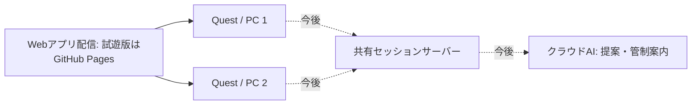

# 公開先・クラウド構成・展示会の予備動作

更新: 2026-09-16 / v0.9.1

## 現在の公開先

v0.9.0で展示入口・観覧用QR・繰り返し飛行・共有版AR切り替えを追加。[展示の準備と8時間の制約](room-lobby-flow.md)。有料契約・追加のクラウドサービス・独自ドメインは導入していない。

v0.9.1では共有版の管制状況と端末の定型読み上げを追加。日本語音声のないブラウザは文字で確認する。外部AI・Aivis Cloud・OpenAIの鍵や課金は設定していない。[役割と接続設計](tower-and-voice.md)。

管制の自動確認は、ビルド後に`npm run dev:shared`を起動し、別のターミナルで`npm run test:tower`。実際の共有サーバーと模擬Questを使い、音声API部分はモック。`output/tower`へ画面と結果を保存する。共有時計をローカルだけ早送りする操作は設けない。

Cloudflare配置版ID: `090a543e-f9f3-4b2f-b817-5d6e19515240`。型検査・ビルド・dry-runとローカル検証後に配置。公開URLで展示入口8項目と実際のalarmによる次便開始・最新設定の採用・停止が合格（`output/exhibition-public-v090`）。

実装コミット`c12e1fd`の[CI](https://github.com/toM7x7/airplanevoice/actions/runs/35057530437)と[Pages公開](https://github.com/toM7x7/airplanevoice/actions/runs/35057530448)が成功し、Pagesが当該ビルドのアセットを配信していることを確認。Quest実機と8時間の連続運用は確認待ち。

### 展示とARを試す

1. 下記の共有版で「展示用の部屋をつくる（8時間）」を押す。
2. 機体・航路を準備し「展示の飛行を始める」。操作を続けなくても1機ずつ繰り返す。
3. 「展示のQR・編集者の招待」で来場者用を選び、Questへ渡す。編集者用は運営だけに渡す。
4. 来場者は「Questで体験をはじめる」。操作盤の「見え方・操作案内」→「現実に機体を重ねる」で基本AR。戻すときは「仮想の空に戻る」。
5. 操作盤を閉じて眺め、側面のグリップで呼び戻す。「ブラウザに戻る」で退出しても他の端末の飛行は続く。

今回のARは同じARセッション内の背景切り替え。会場の実際の座標合わせ・地図・ブース案内は未実装。QRは部屋の8時間の期限内で再利用でき、翌日以降も使う恒久ロビーではない。Quest実機の透過映像・文字・音と装着し直した際の復帰を確認する。

### 以前の公開記録

v0.8.1で光・環境反射・コード生成機体を改善した。Cloudflare配置版IDは`432488c9-4ba1-4985-91de-09ddacf9e54c`。契約・WorkerのAPI・保存形式は変更していない。[品質の実装記録とQuestで残る評価](absorbing-flight.md#10-v081の実装記録)。

実装コミット`2f40f6a`の[Pages公開処理](https://github.com/toM7x7/airplanevoice/actions/runs/35046725373)と[CI](https://github.com/toM7x7/airplanevoice/actions/runs/35046725317)が成功。Cloudflare公開版の共有操作10項目も再確認した。

- [共同編集・飛行を試す](https://airplanevoice-shared-sky.tomohaya-falcon-aramaki.workers.dev/?shared=1)：Cloudflare Workers＋SQLite型Durable Objects。アプリとAPIは同一オリジン。
- [従来の単体版](https://tom7x7.github.io/airplanevoice/)：GitHub Pages。設定URL／QR・単体オフライン体験を保持し、共同編集へリンクする。

ユーザー指定のCloudflareアカウントへ配置。2026-09-16に管理画面のWorkers Free／Current planを確認。有料契約への変更、独自ドメイン、D1・R2・AI契約は行っていない。初回の上限・データ寿命は[共有設計](shared-sky.md)。Freeの枠は同じアカウントの他サービス使用量にも影響されるため、展示規模の可用性は別に検証する。

### PC＋Quest 3で試す手順

1. PCで共同編集のURLを開き「共有する部屋をつくる」。
2. 「Quest・もう一台を招待」を開き、URLを渡すか、表示されたQRをQuestからXRQR等で読む。
3. Questのブラウザで同じ部屋へ入ったら「VRで空に立つ」。必要なら操作盤の「音を聴く」を押す。
4. PCとQuestのどちらからでも、機体・航路・高度・速度を変更する。VRの「2地点を動かす」ではA/Bを選び東西南北へ移動する。
5. 「一緒に飛ばす」。飛行中の編集は次便用の下書き。「次の便を予約」で現在の便と音の余韻の後へ予約でき、発進前は取り消せる。
6. 「自分の音を休む」やVR退出で相手の飛行は止まらない。同じ招待URLで1時間の期限内に入り直せる。残したい設定はJSONで保存する。

再接続後は現在の便へ追いつく。通信断中に行った操作を後からまとめて上書きする方式にはしない。部屋期限が切れたら、この共同編集URLから新しい部屋を作る。展示会で終日使う固定QR・永続ルームはまだ別途設計が必要。

### ローカル起動と配置

```sh
npm ci
npm run check:worker
npm run build
npm run dev:shared
# http://127.0.0.1:8787/?shared=1
```

別端末で`npm run dev`を起動すると、Viteの`/api`を8787へ転送して編集できる。WorkerのローカルDBは`.wrangler`に保存され、クラウドとは別。`npm run test:shared`で実際のWebSocketとブラウザ2台・Quest模擬を検証する。公開版へ向ける場合は`SHARED_URL`と`SHARED_OUTPUT`を指定する。

```sh
npx wrangler whoami
npm run check:worker
npm test
npm run build
npx wrangler deploy --dry-run
npx wrangler deploy
```

`wrangler.jsonc`に指定アカウントを固定している。CLI認証と対象アカウントのFreeプランを確認してから配置する。アプリ内の接続先は同じオリジン。Pagesの共有入口を変更した場合も、CloudflareとGitHub Pagesの両方の成果物へ反映する。GitHub ActionsにCloudflareの資格情報は保存していないため、共有版の配置は手動CLI。

### 実機で残る確認

2026-09-16、ユーザーがQuestの共有版QR入室・共有・同期を確認したと報告。以下は引き続き確認する個別項目。

- PC→Quest、Quest→PCの編集・発進・次便の取消。
- 本体スピーカーで1機の厚み・方向・遅れて聞こえる感覚。各端末の休憩・音量が相手を止めないこと。
- 同じ機体を眺めたときの時刻・位置のずれ、通信断と復帰、Questのフレーム時間。
- 招待QRの再読取、期限切れから新しい部屋への導線。

AR・現実空間の位置合わせ・ブース案内は[2モードの設計](ar-modes.md)までで、公開機能には含めない。

## これまでの単体版配布と設計の記録（v0.5.2時点）

GitHub Pagesで静的Webアプリの試遊版を配信する。独自ドメインは取得しない。**本番の配信・共有・DB・AI基盤は未決定**で、[本番環境の相談](production-options.md)でCloudflare、Vercel等と比較する。

公開URL: [SOUND TRAILを試す](https://tom7x7.github.io/airplanevoice/)

v0.5.2で機体に重なる軌跡・波紋を薄くし、VRとPCに選択解除を追加。コミット`2633fc1`の[公開処理](https://github.com/toM7x7/airplanevoice/actions/runs/34948142221)・[CI](https://github.com/toM7x7/airplanevoice/actions/runs/34948142084)が成功。見え方と解除操作の実機評価は[再試遊](quest-vr.md)で確認する。

公開URLのVR模擬19項目が合格。3機と合成後の同時波形、通常・音設定の両ページでの選択解除、情報・マークの消去、全体ミックスへの復帰、休憩の保持・再選択を確認した。結果と画像は`output/vr-v052-public`に保存。Questでの見やすさの受入とは分ける。

前版v0.5.1ではコミット`3dc13fa`の[公開処理](https://github.com/toM7x7/airplanevoice/actions/runs/34941367316)・[CI](https://github.com/toM7x7/airplanevoice/actions/runs/34941367306)が成功。公開URLのVR17項目と単体オフライン復帰を確認した。続くQuest 3実機の再試遊で、3機とも聞こえたと回答を受領。配布アプリにテスト用エミュレーターは含めない。

`.github/workflows/pages.yml` がmainへの変更を受け、テスト・ビルドを通してdistを公開する。3D描画と音は参加者のブラウザで動く。現段階の「クラウド」はWebアプリの配信であり、共有部屋やAIのクラウド処理はまだ接続していない。

2026-09-15、[公開処理](https://github.com/toM7x7/airplanevoice/actions/runs/34920761566)と[CI](https://github.com/toM7x7/airplanevoice/actions/runs/34920761559)が成功。公開URLで起動、機体設定の変更、初回保存、通信遮断後の再読み込み、設定復元、実時間の飛行と音声ノードの再生、接続復帰を確認した。Quest実機や人による音の評価は別途必要。

## 通常構成の到達目標



- 配信: 画面・3D・音響エンジン・基準素材。
- 共有サーバー: 部屋、予定の版、開始時刻、参加・再参加。実装先は2台の同期試作に合わせて選ぶ。
- AIサービス: 機体／航路／演目の提案と管制案内。APIキーはサーバー側に置く。
- 各端末: 共通予定から飛行位置を算出し、自分の位置に届く音を計算する。

現在のGitHub Pagesは試遊版の静的配信を担当する。共有状態やAI処理のサーバーは追加が必要。本番では配信先自体も比較し、試遊URLが決まったことを最終構成の決定とは扱わない。

## ローカルは予備手段

| 状況 | v0.3でできること | 今後の設計 |
| --- | --- | --- |
| 接続できる | 公開URLを開いて単体体験 | 共有セッション、クラウドAI |
| 一度読み込み済みでネットが切れた | 保存済みアプリを再読み込みし、端末内で作る・飛ばす・聴く | 共有から単体への切り替え案内、復帰時の再参加 |
| 初めて来た端末でネットがない | 公開URLからは取得できない | 会場PCでの配信、LANとHTTPSを事前準備 |
| AIが応答しない | 現行のルール案内、手動の編集を利用 | サーバー側のタイムアウトと定型案内への切り替え |

ローカルLLMは設計候補。今回、新しいモデルの取得やAI連携の実装はしていない。Ollamaなどを使う場合も、通常のクラウドAIと同じレシピ／事実イベントの入出力へ接続し、会場PCでの実行を追加できる形を検討する。

## オフライン保存の実装

`npm run build` の最後に、`scripts/write-offline.mjs` がビルド成果物のハッシュとファイル一覧からService Workerを生成する。配布版だけで登録する。

- HTML・JS・CSS・アイコンを保存。外部サービスへのリクエストは保存対象にしない。
- HTMLはオンライン取得を優先し、通信できなければ保存済みHTMLを使う。
- キャッシュ名にアプリのパスを含め、同じドメインの別プロジェクトと分ける。
- 更新は開いている体験を強制リロードせず、古いタブを閉じた後に切り替える。
- 航路と機体設定はlocalStorageに保存。別のブラウザや公開URL・localhost間では共有されない。

初回取得の完了とブラウザ内の保存が必要。キャッシュ削除・容量整理・プライベート閲覧などで消える場合があるため、展示会では当日の端末で機内モード再読み込みを試しておく。現在の予備動作は単体体験で、切断中の共有やAI応答を再現するものではない。

## 手元の配布版を使う

```sh
npm ci
npm run build
npm run preview
```

PC上の `http://127.0.0.1:4173/` で配布版を確認する。`dist`を保持すればアプリの取得に外部ネットワークは不要。別のQuestからPCへ入る会場LAN配信には、ホスト設定・証明書・到達確認が別途必要で、現段階では未整備。

## 検証

### v0.6.0 — PCからQuestへの設定受け渡し

2026-09-15、アプリのコミット`4f6f88b`を公開。[公開処理](https://github.com/toM7x7/airplanevoice/actions/runs/34951543950)と[CI](https://github.com/toM7x7/airplanevoice/actions/runs/34951544082)が成功した。

公開URLのVR模擬20項目が合格。受け渡し12項目の先行試験は受信URLのパスを補っていたため、後続のXRQR通し確認で公開パスの欠落を発見した。相対baseを現在のページURLから解決する修正と、生成URLをそのまま開く検証へ変更した。初回QR生成を通信遮断後に行う検証、別ブラウザでの取消・保存・飛行中拒否などを修正後に再確認する。

共有データはURL fragmentに含み、新しいサーバー・DB・認証を追加していない。設定保存は端末内、同期時刻や共有部屋は後続。[受け渡し手順](sky-transfer.md)。

修正コミット`559a590`は[公開処理](https://github.com/toM7x7/airplanevoice/actions/runs/34951925577)・[CI](https://github.com/toM7x7/airplanevoice/actions/runs/34951925564)が成功。修正後の公開受け渡し12項目が全て合格し、`output/transfer-public-v060-fixed`に保存した。実際のXRQRサイトからも合成カメラによる読取→URL全文コピー→公開ページを開く→明示取り込みが合格。物理Questのカメラ許可と読取性能は未確認。

`npm run test:offline` は配布版に対し、初回保存→ネット遮断→再読み込み→保存した機体の復元→飛行と音出力→接続復帰を確認する。公開URLでも環境変数`SOUND_TRAIL_URL`で同じ確認ができる。

技術参照: [GitHub PagesのActions公開](https://docs.github.com/en/pages/getting-started-with-github-pages/using-custom-workflows-with-github-pages)、[Service Workerの保存と更新](https://developer.mozilla.org/en-US/docs/Web/API/Service_Worker_API/Using_Service_Workers)。
