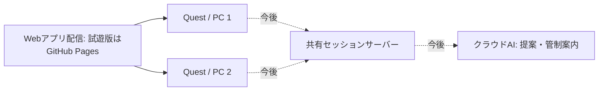

# 公開先・クラウド構成・展示会の予備動作

更新: 2026-09-15 / v0.5.2

## 試遊版の公開先

GitHub Pagesで静的Webアプリの試遊版を配信する。独自ドメインは取得しない。**本番の配信・共有・DB・AI基盤は未決定**で、[本番環境の相談](production-options.md)でCloudflare、Vercel等と比較する。

公開URL: [SOUND TRAILを試す](https://tom7x7.github.io/airplanevoice/)

v0.5.2で機体に重なる軌跡・波紋を薄くし、VRとPCに選択解除を追加。コミット`2633fc1`の[公開処理](https://github.com/toM7x7/airplanevoice/actions/runs/34948142221)・[CI](https://github.com/toM7x7/airplanevoice/actions/runs/34948142084)が成功。見え方と解除操作の実機評価は[再試遊](quest-vr.md)で確認する。

公開URLのVR模擬19項目が合格。3機と合成後の同時波形、通常・音設定の両ページでの選択解除、情報・マークの消去、全体ミックスへの復帰、休憩の保持・再選択を確認した。結果と画像は`output/vr-v052-public`に保存。Questでの見やすさの受入とは分ける。

前版v0.5.1ではコミット`3dc13fa`の[公開処理](https://github.com/toM7x7/airplanevoice/actions/runs/34941367316)・[CI](https://github.com/toM7x7/airplanevoice/actions/runs/34941367306)が成功。公開URLのVR17項目と単体オフライン復帰を確認した。続くQuest 3実機の再試遊で、3機とも聞こえたと回答を受領。配布アプリにテスト用エミュレーターは含めない。

`.github/workflows/pages.yml` がmainへの変更を受け、テスト・ビルドを通してdistを公開する。3D描画と音は参加者のブラウザで動く。現段階の「クラウド」はWebアプリの配信であり、共有部屋やAIのクラウド処理はまだ接続していない。

2026-09-15、[公開処理](https://github.com/toM7x7/airplanevoice/actions/runs/34920761566)と[CI](https://github.com/toM7x7/airplanevoice/actions/runs/34920761559)が成功。公開URLで起動、機体設定の変更、初回保存、通信遮断後の再読み込み、設定復元、実時間の飛行と音声ノードの再生、接続復帰を確認した。Quest実機や人による音の評価は別途必要。

## 通常構成の到達目標



- 配信: 画面・3D・音響エンジン・基準素材。
- 共有サーバー: 部屋、予定の版、開始時刻、参加・再参加。実装先は2台の同期試作に合わせて選ぶ。
- AIサービス: 機体／航路／演目の提案と管制案内。APIキーはサーバー側に置く。
- 各端末: 共通予定から飛行位置を算出し、自分の位置に届く音を計算する。

現在のGitHub Pagesは試遊版の静的配信を担当する。共有状態やAI処理のサーバーは追加が必要。本番では配信先自体も比較し、試遊URLが決まったことを最終構成の決定とは扱わない。

## ローカルは予備手段

| 状況 | v0.3でできること | 今後の設計 |
| --- | --- | --- |
| 接続できる | 公開URLを開いて単体体験 | 共有セッション、クラウドAI |
| 一度読み込み済みでネットが切れた | 保存済みアプリを再読み込みし、端末内で作る・飛ばす・聴く | 共有から単体への切り替え案内、復帰時の再参加 |
| 初めて来た端末でネットがない | 公開URLからは取得できない | 会場PCでの配信、LANとHTTPSを事前準備 |
| AIが応答しない | 現行のルール案内、手動の編集を利用 | サーバー側のタイムアウトと定型案内への切り替え |

ローカルLLMは設計候補。今回、新しいモデルの取得やAI連携の実装はしていない。Ollamaなどを使う場合も、通常のクラウドAIと同じレシピ／事実イベントの入出力へ接続し、会場PCでの実行を追加できる形を検討する。

## オフライン保存の実装

`npm run build` の最後に、`scripts/write-offline.mjs` がビルド成果物のハッシュとファイル一覧からService Workerを生成する。配布版だけで登録する。

- HTML・JS・CSS・アイコンを保存。外部サービスへのリクエストは保存対象にしない。
- HTMLはオンライン取得を優先し、通信できなければ保存済みHTMLを使う。
- キャッシュ名にアプリのパスを含め、同じドメインの別プロジェクトと分ける。
- 更新は開いている体験を強制リロードせず、古いタブを閉じた後に切り替える。
- 航路と機体設定はlocalStorageに保存。別のブラウザや公開URL・localhost間では共有されない。

初回取得の完了とブラウザ内の保存が必要。キャッシュ削除・容量整理・プライベート閲覧などで消える場合があるため、展示会では当日の端末で機内モード再読み込みを試しておく。現在の予備動作は単体体験で、切断中の共有やAI応答を再現するものではない。

## 手元の配布版を使う

```sh
npm ci
npm run build
npm run preview
```

PC上の `http://127.0.0.1:4173/` で配布版を確認する。`dist`を保持すればアプリの取得に外部ネットワークは不要。別のQuestからPCへ入る会場LAN配信には、ホスト設定・証明書・到達確認が別途必要で、現段階では未整備。

## 検証

`npm run test:offline` は配布版に対し、初回保存→ネット遮断→再読み込み→保存した機体の復元→飛行と音出力→接続復帰を確認する。公開URLでも環境変数`SOUND_TRAIL_URL`で同じ確認ができる。

技術参照: [GitHub PagesのActions公開](https://docs.github.com/en/pages/getting-started-with-github-pages/using-custom-workflows-with-github-pages)、[Service Workerの保存と更新](https://developer.mozilla.org/en-US/docs/Web/API/Service_Worker_API/Using_Service_Workers)。
