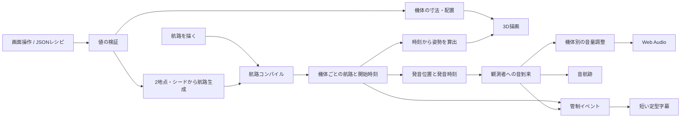

# エンジンの構成と共有への境界

更新: 2026-09-15 / v0.4.0。現行実装と今後の設計を分けて記載する。

## 現在のデータの流れ

## コードの責務

| モジュール | 入力 → 出力 | 保つ条件 |
| --- | --- | --- |
| `workshop.ts` | 機体・2地点・シード・飛行設定 → 検証済みレシピと航路 | 任意コードを実行せず、値域と項目を検証 |
| `route.ts` | 描線・機体プロファイル → コンパイル済み閉路 | 有限の座標、滑らかなつながり、再現できる経路 |
| `evolution.ts` | 最初の航路・周回番号・変化量 → 次の航路案 | 同じ条件で再現可能。変形を累積しない。2地点の制約を保持 |
| `flight.ts` | 閉路・経過時刻 → 位置・向き・バンク | 描画フレーム数に依存しない |
| `airspace.ts` | 主航路・機数・開始間隔 → 機体別の計画 | ST-01は編集した航路を保持。追加機は平行移動 |
| `acoustics.ts` | 発音・観測位置 → 到来時刻・Doppler | 音源は過去の発音位置。各音は一度だけ消費 |
| `airspace.ts / soundMix` | 機体一覧・聴き方・注目機 → 相対ゲイン | 飛行と音到来の時刻を変更しない |
| `tower.ts` | 型付き事実イベント → 字幕 | 古い状況を連続表示しない。無効時は表示しない |
| `experience.ts` | 操作・経過時間 → 全体状態 | 全機の飛行と音の到来が終わってから次周へ |
| `observation.ts` | 選んだ機体と現在状態 → 速度・方位・高さ・距離 | 状態を変更しない。待機・終了時に周回した位置を表示しない |
| `audio.ts` | 到来・ゲイン → HRTFの音源 | 発音位置を動かさず、機体別バスで滑らかに調整 |

## 作る体験の現行モデル

画面とJSONは `WorkshopRecipe` に集約する。`applyWorkshop` は機体と航路全体を検証・コンパイルしてから反映し、失敗時は直前の有効な状態を保つ。任意のJS/TSを実行する機能はない。

2地点の航路は、A/Bで高さを保つ周期的な曲線を生成する。固定シードは低周波のゆらぎを決める。A/Bを動かさずに必要な旋回幅を広げ、上下の振幅を飛行プロファイルの高度・勾配に収め、512点の等距離サンプルにする。飛べない配置は理由を返す。描線用のB-splineとは入力経路を分けている。

傾きは、0〜3秒の有限な過去の曲率を8点の重み付き平均で求める。位置と音の時刻は変えず、フレーム履歴に依存しない滑らかなバンクを作る。質量・揚力・慣性モーメントから運動を解く段階には達していない。

機体は部品の変形・配置で作る。52個の窓をInstancedMeshにまとめ、距離と画角に応じて窓・操縦席・吸気口の細部を省略する。外形とエンジン本体は残す。詳細と測定は[技術の実験候補](technology-experiments.md)。

配布版はService Workerで静的ファイルを保存する。オフラインでも単体の飛行時計と音響は動く。通常のクラウド配信、共有サーバーとAIの将来構成は[配信設計](deployment.md)を参照。

## 周回ごとの航路生成

`evolveRoute`の条件と範囲は[条件から変わり続ける飛行](procedural-flight.md)を参照。`Experience`は全機の音到来完了→6秒の余白→生成・コンパイル→予定確定を管理する。失敗時は自動継続を止め、直前の有効な航路を保持する。飛行中の航路と発音位置は変更しない。

最初の航路を1組だけ保持し、編集復帰で戻す。周回の保存を明示した場合は現在の航路を残す。Undo・ログ・航跡・音声は既存の上限に従う。自動継続設定は端末保存しない。`FlightMap`はコンパイル済みの現在の主航路を描き、飛行中のST-01の位置を表示する。音の分布図や実測マップではない。

## 選んだ機体の情報

`aircraftInfo`は現在の飛行状態を読み取る。方位は機体の進行接線から求め、北（-Z）を0°、東（+X）を90°とする。カメラの向きや観測者から機体への方角とは別。高さはワールド原点のY、距離は観測者との3次元距離。待機中・終了後・非表示の追加機プレビューでは数値を返さない。

選択IDは画面の状態に持ち、音の注目IDや航路・時計を変更しない。数値は既存の約100ms間隔の状態通知で更新し、選択マーカーは描画に追従する。「この機体の方を向く」はカメラを一度向ける操作で、自動追尾や機体搭乗視点ではない。

画面へ投影した機体の周囲を選択範囲とする。ドラッグとクリックを分離し、タッチは最小直径44px、マウスは32px。厳密なメッシュ交差や遮蔽判定を行う段階ではない。数値カードとマーカーのために3Dの描画呼び出しは追加しない。

## 空域と音の上限

- 追加機の水平移動: ST-02 `(480, -420)` m、ST-03 `(-560, -780)` m（X, Z）。高さはそれぞれ最大+85m、+165m、650mを超えないように抑える。
- 開始間隔は0、8、16秒。元航路の形状、長さ、速度は共有。ユーザーが別々の航路を描く機能は今後。
- 発音IDは機体内の番号。アプリ全体では `flightId + emission.id` で識別する。航跡も異なる機体間を結ばない。
- 相対ゲインは注目機1、背景機0.24。空全体モードは全機1。その後、ゲインの二乗和が1になるよう正規化する。
- この正規化は信号の配分規則であり、測定された音圧・聴感上の等音量ではない。相関した音の加算も起こるため、最終出力にコンプレッサーを残す。
- 各機6音声、全体18音声の上限。機体ごとに枠を持ち、先に処理した機体が全枠を占めないようにする。
- 機体別GainNodeを時定数0.25秒で更新する。背景機の音も残す。距離減衰は各PannerNodeが担当する。
- 画面外の機体も音が到来する。注目してもカメラは自動回転しない。

平行移動した航路は**比較用の配置**。ユーザーが描く全経路で衝突しないこと、航空管制として成立することは保証しない。

## 管制案内の現行ルール

`TowerFact` は `scheduled / started / first-arrival / ended / clear` と、その発生時刻、対象機、機数・間隔を持つ。今は同じローカルシミュレーションから生成する。

- 初期状態はOFF。ONにして飛ばすと、開始前の予定を表示。
- 1つの字幕は最大5.5秒、表示開始同士は8秒以上離す。
- 待機イベントは最大12件、発生から8秒以上経過したものは破棄。
- 優先度は予定、全体終了、機体の開始、最初の音、機体の終了の順。
- 注目機が観測者から650m未満を飛行している間は、表示を消して新規表示を控える。これは現時点の演出条件であり、将来は「実際に届く近接音」の時間帯との比較も必要。
- 一時停止でシミュレーション時刻を止め、字幕を隠す。編集・再周回・無効化で待機字幕を破棄。

表示は字幕のみ。AIや音声での案内は未実装。

## 複数Questに拡張する際の設計方針（未実装）

**共有するもの**: 部屋ID、飛行ID、コンパイル済み航路または同一結果を再現できるデータ、チェックサム、開始時刻、予定の版。

**各端末で決めるもの**: 観測者の位置・頭の向き、各音の到来、注目機、音量、表示負荷。音量設定を共有状態に混ぜない。

信頼するサーバーが予定と開始時刻を確定し、端末は共通時刻との差を補正する。飛行位置そのものを毎フレーム送る方式を基本にしない。途中参加は予定のスナップショットから復元し、既に過ぎた音を一斉再生しない。現行のローカルPauseは共有空間での全員停止には流用せず、離席と共有時刻の継続を分ける。

同室ARでの原点・向き合わせ、遠隔参加での仮想原点、途中復帰、端末間ずれの観測ログを、2台の実機で検証する。QRは入室URLを渡す入口として考え、空間位置合わせが別に必要かを実機方式ごとに確認する。

## AI接続時の提案と確定（未実装）

AIへの入力は、飛行予定のスナップショットと型付きの事実イベント。AIの出力を「字幕案」「飛行案」「開始順序の変更案」に分ける。変更案には対象ID、元の予定の版、期限、提案値を付ける。

予定の存在、版、期限、座標、速度・旋回などをエンジン側で検証してから適用する。ユーザーが飛ばしたいという意図の範囲で動く。AI応答の待ち時間を飛行時計へ混ぜない。通信が切れた時にも飛行と音の体験は成立させる。

## 技術参照

- [MDN WebXR Device API](https://developer.mozilla.org/en-US/docs/Web/API/WebXR_Device_API): VR/ARの入力・描画とセキュアコンテキスト。対応は実機・ブラウザで確認する。
- [MDN requestSession](https://developer.mozilla.org/en-US/docs/Web/API/XRSystem/requestSession): 必要機能／任意機能を指定してセッションを要求する。
- [MDN DynamicsCompressorNode](https://developer.mozilla.org/en-US/docs/Web/API/DynamicsCompressorNode): 音の加算後にダイナミックレンジを抑える。
