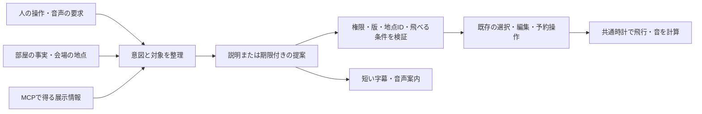

# AIRPLANEVOICE — 体験・エンジンの再設計

更新: 2026-09-17 / v0.11.0。最新の会話を反映した現行方針。**方針・実装済み・未実装を分ける。**

2026-09-18棚卸し: 現在地と直近の作業順は[進捗](progress-overview.md)、技術の採用状態は[技術一覧](technology-experiments.md)へ集約。会場へ進む前提となる2台の位置合わせを維持し、その準備中に新メニューと共有・制作UIの統合を進める案。TypeSafeを各エンジンの判断へ使う比較実験も追加した。下の6体験と原点は変えない。

**同日の追加指示で順序を変更**：AI・MCP・押す場所の案内を優先し、PC／Quest単体で成立させる。以下8節のB→C→Eという初期順序は最新の優先順ではない。[AI仕様・予算](ai-guide-spec.md)と[更新済みの順序](progress-overview.md)に従う。2台の位置合わせは機材が使えるときに再開する。

## 1. 機能が増えても守る原点

> 巨大で重い旅客機が滑らかに通り過ぎ、姿より遅れて音が届く。その空を、隣の人と別々の視点から見上げる。

元の青写真の「原体験」「姿と音の分離」「二人で同じ線を直す」を中心にする。現在のユーザー指示に従い、独立したWebサービスとして進める。WordのXRift前提や初期の単機制約は現行の必須条件にしない。原本3冊とキーワード棚卸しは変更しない。

観察の報酬は「もう一度見たい・聴きたい」。複雑な演目編集やAIとの会話を、入場して空を見るための必須操作にしない。作る自由と、何もしないで見惚れる時間を両立する。

後続の見た目の磨き込みとして、[入口とVR／AR切り替えの画面案](visual-transitions.md)を作成した。機体と音を続けて背景を透過する案を中心に検討する。画像による構想段階であり、以下の実装順と実機確認の優先は変えない。

## 2. 6つの体験、先に育てる4つ

来場者の操作は**手・指を基本とし、声へ拡張する方針**に更新。コントローラーは作り手の編集と代替操作へ。[手操作と動きの設計](hand-and-motion.md)にローカル試作、公開版との境界、実機での受入を記録した。

これは**体験の種類**。従来の[開発6段階](progress-overview.md)とは別の軸で、4/6完成という数え方はしない。

| 世界 | VRで見る | ARで見る | 優先・現在地 |
| --- | --- | --- | --- |
| 仮想の空 | 空・地形と旅客機を見上げる | 今の飛行を現実の周囲に重ねる | **優先1・2**。共有飛行、頭部ごとの音、背景切り替えを実装。実機の磨き込みを継続 |
| 展示会場 | 小さな地図で全体を調べ、地点を選ぶ。将来は会場内の視点へ | 地図と地点を実寸にして会場へ合わせる | **優先3・4**。地点共有・縮小配置図・実寸地点・手動校正まで。会場図画像・案内飛行・会場再現は未実装 |
| 空港・周辺エリア | 任意の空港・街のモデルで観察する | 地理座標の機体・空間を現地へ重ねる | **追加5・6**。未実装。PLATEAU・実飛行データは独立した発展候補 |

空港版は、まず仮想便を飛ばす構成でも成立する。実飛行データへの接続を必須にしない。実際の便を利用する場合も、位置情報と再現したエンジン音を分けて示す。

### 3つの選択を混ぜない

1. **世界**：仮想の空／展示会場／将来の空港。何を見るか。
2. **背景**：仮想背景／パススルー。どこに重ねるか。
3. **見方**：地上で観察／縮小地図で全体を見る／実寸の地点を見る。どの距離感で見るか。

6本の別アプリや別エンジンは作らない。同じ部屋の会場データと飛行予定を使い、各端末が見方を選ぶ。PCを編集専用、Questを観覧専用には固定しない。観覧招待の変更制限は維持する。

現行WebXRは、対応端末では`immersive-ar`内で仮想背景を描く／隠す方式。「VRで見る」は見え方の呼び方で、毎回セッション種別を変更する意味ではない。非対応端末はVRの入口を使う。

## 3. 操作の流れ

### 初めての来場者

QRから展示部屋 → 空を開く → 旅客機を見上げる。操作盤は閉じて眺められ、グリップで戻せる。「音を休む」「ブラウザへ戻る」は残す。

### 会場を調べる人

小さな配置図を開く → 地点の名前・説明を見る → 手動で選ぶ → 将来は「ここへ案内する」で飛行案を確認する。AIを使う場合も、この地点選びと同じ入口へ接続する。

### 現地へ重ねる人

同じ会場データ → 現実に重ねる → 机の基準A・Bで各端末を合わせ、Cで確認 → 実寸の地点を見る。全員へ同じ映像を配るのでなく、各人の頭の位置から同じ地点を見る。

**小さな地図を開く操作と、現地への位置合わせは別。** 地図を見ただけでは位置合わせ済みにしない。QRのURL読み取りも現実の原点・向きの計測を代替しない。

## 4. v0.11.0で追加した範囲

- 共有版PC／XRに「小さな地図で見る」「実寸の地点を見る」「地図を隠す」。表示変更は自分だけ。
- 地点と原点Aを同じ倍率で収める小さな配置図。番号・地点名・共有選択の強調・縮尺を表示。実際の会場図画像を使った図ではない。
- 小さな図は開いたときの前方に置き、頭を動かしても追い掛けない。もう一度「小さな地図で見る」で置き直せる。XRでは操作盤との重なりを避け、グリップで操作盤を出す間は図を隠す。地点選びは既存の操作盤から行う。
- 実寸表示は従来のメートル座標を利用。地点を縮小保存せず、飛行の予定・時刻・耳の位置・音速も変更しない。
- 原点が失われたときは従来どおり実寸の機体・地点を隠して再校正する。小さな図は位置合わせの証明ではないため、参照用として開ける。

**まだないもの**：会場図画像の登録・建物再現、地図のピンへの直接レイ選択、地点ごとの視点・耳への移動、ブース間の案内飛行、外部MCP／LLM／音声API。新しい縮小地図を「会場VR完成」とは扱わない。

## 5. 座標・縮尺・音のルール

| データ | 単位・担当 | 変更してよい範囲 |
| --- | --- | --- |
| 図面の画像 | ピクセル。将来の会場データ取り込み | 実測対応点から会場のmへ換算 |
| 会場の地点・将来の案内航路 | 共通のメートル座標 | 管理対象の配置として版を持つ |
| 小さな配置図 | 表示専用の倍率 | 端末内だけ。元の地点・飛行へ書き戻さない |
| 実寸AR | 会場座標→端末の位置・水平回転 | 端末別の校正。世界の縮尺は1のまま |
| 耳・頭 | 会場／飛行と同じ共通座標 | 観測者本人の動き。図の縮小率を掛けない |
| 飛行時計 | サーバーの共通時刻 | 表示切り替えやAI待ちで巻き戻さない |

通常の旅客機を縮小図へ自動で押し込まない。数百mの旋回を数mのブース間へ縮めると、速度・迫力・遅延・音量の意味も変わる。会場案内用の小型表示・ゆっくりした飛び方は、通常の旅客機プロファイルと分けて次に設計する。現状の飛行エンジンへ近距離の座標を渡すだけでは成立しない。

将来「この地点の音を聴く」を追加する場合は、**耳の試聴位置を明示して切り替える**。身体の実位置と混同せず、元の耳へ戻す操作と音の切り替えを用意する。現行では地図の選択先へ耳を移動しない。

### 実際の図面を取り込む次の設計

- 会場ID、図面の版、画像参照、利用条件、実測日を持つ。大きい画像を部屋のWebSocket状態へ直接詰め込まない。
- 図面上の対応点と実測距離から縮尺・向きを求め、推定に使わない別の点で誤差を確認。机のA/B校正と図面の校正は別工程。
- ブースID、名前、入口、案内用の到着点、説明の出典を登録する。通路は別データ。飛行線を人の歩行経路として扱わない。
- 机の短い基準線で合わせられても、遠いブースの一致まで確認済みにはしない。複数の距離・方向でずれを記録してから利用範囲を決める。
- 現行の地点は最大4、各軸±25mの試作。会場全域へ広げる時は上限・分割・読み込みと管理権限を見直す。

## 6. エンジンごとの品質向上

大きな一括書き直しより、同じ条件の比較で1つずつ改善する。[現行のモジュール境界](engine-design.md)を再利用する。

| 担当 | 現行の土台 | 次の品質課題・確かめ方 |
| --- | --- | --- |
| 機体の形・材質 | コード生成の胴体・翼・エンジン、寸法変更、距離で細部省略 | 地上の通常距離で輪郭・側面の光・エンジンの奥行きが読めるか。Blender部品も同じ寸法・材質・詳細度の契約へ合わせる |
| 航路・飛行姿勢 | 描線／2地点→滑らかな閉路、一定時刻から再現する姿勢 | 翼の落ち着き・旋回開始・重さの印象。地上飛行と会場案内の半径・速度・高度を別に検証。流体解析済みとは呼ばない |
| 空域・共有予定 | 同じ予定・時計、下書きと次便の分離 | 複数機の間隔・予約の競合。LLMに毎フレーム操縦させず、エンジンで飛べる案へ検証。衝突回避は別の未実装課題 |
| 音色 | 双発／四発の合成音、機体別バス | 旅客機らしい低〜中域の厚み、通過前後の変化、Quest 2／3本体スピーカーでの聴きやすさ。実録音・物理音圧とは区別 |
| 音の伝播 | 過去の発音位置、到来時刻、観測者ごとの方向 | 2人が違う場所で聴く定位・遅延・途切れ。同じ音を全端末へ一斉に流す構成に変えない |
| 軌跡・波紋 | 発音履歴から薄い線と輪、視線上の重なりを減衰 | 機体の輪郭を邪魔しない、古い線が強くならない、両眼で違和感がない。航路の編集線／機体の通過履歴／音の到来表現を区別 |
| 空・描画負荷 | 太陽・環境反射、地形、簡易LOD | 同じ便・視点で眩しさと機体の見やすさを比較。Quest 2を含む実機のフレーム間隔・熱・長時間動作 |
| 空間・操作 | 共通座標と端末別校正、PC／XRの同じ操作 | A/B/C、復帰、図面の版変更、日本語、操作盤と地図の見分け |

「見惚れる」は画像1枚やテスト成功だけで完了にしない。同じ便で①機体を見失わない、②音で振り向ける、③傾き・線が気にならない、④もう一度待ちたい、を試遊で記録する。

## 7. AI・MCP・音声を入れる場所

基礎の体験はAIなしで成立させる。**まず状況を読む管制官と会場案内。** パイロット役・機体制作補助は同じ操作へ後から接続する。

- MCPは展示情報の検索経路。現実のブース座標・最新の通路情報があるとは仮定しない。外部の説明文をアプリへの命令として実行しない。
- 「ここへ行きたい」→候補のブースIDと理由→本人が地点を選ぶ→将来の案内便へ。該当IDがない、配置が古い、回答が遅れた場合は説明だけにして、勝手に別地点へ飛ばさない。
- 管制官は現在便・次便・音の到来待ちを区別。人、ルール、LLMが同じ検証済みの操作を使う。提案には元の版と有効期限を持たせる。
- 自律性は段階化：読むだけ→提案する→許可済み範囲の予約を実行。共有便の取り消しや配置変更を、対話参加だけで許可しない。
- 音声は字幕＋手動ボタンを常に用意。まず端末の定型読み上げ、次にAivis等のTTS、必要なら音声対話APIを比較する。プロバイダーや課金開始は未決定。
- 1つの案内だけを発話し、古い返答・入退室・休憩時は破棄／停止。見せ場で機体音を消す常時実況にせず、短い説明と沈黙を扱う。
- APIキーはサーバー側。イベント当日の上限、1部屋・1要求の制限、タイムアウト、使用量表示、課金停止後の定型案内を先に用意する。金額・最新料金は接続時に再確認。

現行の`observeRoom`・定型文・`RoomSpeech`を接続口にする。今は外部AI・MCPを呼び出していない。ローカルAIも導入前提にしない。技術候補と費用の過去調査は[tower-and-voice.md](tower-and-voice.md)を参照。

## 8. 次に進める順序と完了条件

| 順序 | 作業単位 | 完了条件 |
| --- | --- | --- |
| A 今回 | 全体再整理＋縮小図／実寸表示 | 同じ地点を別の見方で確認できる。共有時刻・耳・校正を壊さない。PCと模擬XRで検証し、実機は別記録 |
| B 最優先の実機 | Quest 3＋2で固定机に一致 | [T1〜T4](table-alignment.md)を測る。両者の視差・音・原点リセット・再入場を確認。現時点は0/4 |
| C 優先する4体験へ | 実際の図面＋3ブース＋案内用飛行 | 図面↔mの確認、手動で選ぶ→案内便→同じ地点へ到着、VR／AR往復と誤差確認。AIなしで成立 |
| D 品質を並行改善 | 機体・姿勢・音・軌跡 | 同じ試遊条件で1項目ずつ比較し、Quest 2／3で負荷と魅力を記録 |
| E 会話をつなぐ | 管制官・展示MCP・音声 | 根拠を表示、期限切れの提案を拒否、予算内、返答待ちでも空が動く、手動へ戻れる |
| F 追加2体験 | 任意の空港・周辺エリア | データの入手・利用条件、地理座標、描画量、実飛行データを使うかを個別に検証 |

実装済み項目の細部は[進捗](progress-overview.md)、思いつきの未採用案は[idea-notes.md](idea-notes.md)へ残す。今後のアイデアも、採用・実装・実機受入のどこにあるかを揃えて追加する。
