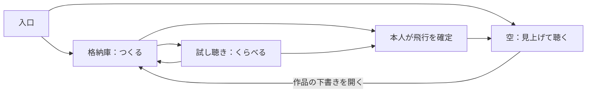

# 格納庫から、音のある空へ

2026-09-22 / 仕様提案。画面分離・模型回転・比較試聴は未実装。本番公開なし。

## 目的

機体を作ることが目的になりすぎず、「自分の一機が頭上を通り、その音に顔を向ける」まで短くつなぐ。PCでもVRでも制作できる。展示ではPC運営者とQuest来場者が別人になることを考慮する。

## 三つの場所

| 場所 | 見えるもの | 主な操作 | 次へ |
|---|---|---|---|
| 格納庫：つくる | 大きな模型、保存した機体、形・音・名前 | 回す、拡大、形を変える、保存、呼び出す | 試し聴き／そのまま飛ばす |
| 試し聴き：くらべる | 一機と短い通過コース、聴く位置 | 同じ条件で再生、変更前後を比較、音を調整 | 作り直す／飛ばす |
| 空：見上げて聴く | 空と飛行機。メニューは閉じる | 注目する、空全体を聴く、音を調整、制作へ戻る | 格納庫へ |

試し聴きは任意。最初から「空を見る」も選べる。初回VRは候補を選ぶだけでも一機を完成できる。画面を戻ることと、飛行中の機体を物理的に帰還させることは別操作。

## PC / VR / AR

- PC：模型を画面の主役にする。ドラッグで機体周囲を回転、ホイールで拡大。正面・横・上・斜め前と「見やすい向きに戻す」を用意。最初は機首と片翼が見える斜め前。形／音／名前は同じ制作画面のタブ。飛行画面の視線操作と分離する。
- VR：格納庫では手の届く模型と少数の大きな選択肢。ピンチ回転と拡大は実機で調整し、固定方向ボタンを代替にする。頭を勝手に回転・移動させない。AIとの会話は任意で、同じ候補を指でも選べる。
- AR：観察は現実背景。制作を開くと手元の作業台が出る。全面を不透明な格納庫へ勝手に切り替えない。机への配置は後段。
- VRの場面変更は短いフェードを候補とする。飛行機の形を模した派手なトランジションは使わない。VR/ARのセッション切替制約とは別に扱い、シームレス動作を保証しない。

## 音が中心になる編集

1. 音は「低い響き」「エンジンのうなり」「風の広がり」のような聴こえ方から選ぶ。専門値はPCの詳細設定へ。
2. 試し聴きはコース、速度、距離、聴取位置を固定して、変更前／変更後を同じ条件で再生する。音色だけの短い試聴と空間を通過する試聴を区別する。
3. 比較用の音と共有空間の音を重ねない。試し聴きは本人だけに聞こえ、共有便は止めない。
4. 飛行中の音変更は次段階。選択した機体に限って滑らかに反映し、「この場の試し調整」と「作品へ保存」を分ける。現状は送り出した時点の形・音で固定。

## 既存コードをどう活かすか

- 制作状態、作品保存、共有操作、AIの共通操作を維持する。
- ローカルの表示状態に `hangar / audition / observe` を追加する。部屋の飛行状態とは分離し、PCが制作中でもQuestの観察を続けられる。
- 制作専用カメラ／模型を分離する。既存の観察カメラを模型回転へ流用しない。場面切替でWebSocketや会話接続を再生成しない。
- 編集途中の状態を保持する。未保存・部屋へ送信中・保存済みを表示し、通信失敗時は下書きを残す。
- AIは現在の場所、選択作品、見えている操作、下書き変更を受け取る。案内は該当タブを開いて実ボタンを強調。飛行・保存の確定は本人に残す。

## 実装順と合格条件

1. **格納庫と観察を分離**：PCで模型を一周見られ、正面に戻せる。往復しても下書き・共有便が失われない。
2. **比較試聴**：同じ通過で音だけを比較できる。試聴が他端末へ漏れず、共有便を止めない。
3. **VRの制作導線**：Questで候補選択→試聴→命名→飛行。指操作、模型の見やすさ、会話中の切替を実機確認。
4. **離発着・帰還、飛行中の音編集**：別工程。景観だけで完成扱いにしない。

## 参考

[Gran Turismo 7公式ガレージ案内](https://eu.gran-turismo.com/us/gt7/manual/home/01)にある「所有物を選ぶ・調整する・眺める」の役割分離を参考にする。画面や素材を複製せず、こちらでは音の比較を中心に置く。

## Questでローカル版を試す

現時点でPCの8787番はHTTP 200。ADBは導入済みだが `adb devices` の端末一覧は空。ヘッドセットでの起動確認は未実施。

1. Questの開発者モードを有効にし、データ通信対応USBでPCへつなぐ。Quest内のUSBデバッグ確認を許可する。
2. PowerShellで `adb devices`。対象が `device` なら `adb reverse tcp:8787 tcp:8787` を実行。`unauthorized` はヘッドセット内の許可を確認。複数台なら `adb -s 端末ID reverse tcp:8787 tcp:8787`。
3. PCのローカルサーバーを動かしたまま、Quest Browserで `http://127.0.0.1:8787/?shared=1` を開く。PCと同じ部屋に入る場合はPCの招待URLを使う（部屋とキーを含む）。
4. ブラウザ内のVR開始を押す。USBはサーバーへの転送に使い、描画はQuest側。Quest Linkの起動は不要。
5. USBを外すと転送は使えなくなる。終了時は `adb reverse --remove tcp:8787`。無線で試すならQuestが信頼できるHTTPS接続を別途用意する。公開版にはまだ今回のローカル更新が入っていない。

PCのlocalhostをQuestへ単純に入力するだけでは、PCを参照しない。同じWi-Fiでも通常の `http://PCのLANアドレス` はWebXRの安全な接続条件を満たさない。

参照：[Chrome公式ポート転送](https://developer.chrome.com/docs/devtools/remote-debugging/local-server)、[MDN安全なコンテキスト](https://developer.mozilla.org/en-US/docs/Web/Security/Defenses/Secure_Contexts)。Meta公式リモートデバッグページは今回取得タイムアウトのため、新たな裏付けとしては扱わない。
