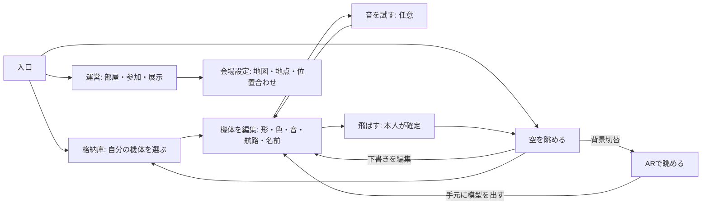

# PC / VR / AR の画面・操作フロー再整理

2026-09-22。ユーザーへの提案。UI画像は選定用の未実装案。本番コードはこの検討では変更しない。

## 採用方向（ユーザー指定・2026-09-22追記）

- 前回表示順1を土台、2の端的な編集メニューを採用。1/3の空・空港・格納庫の環境を重視。
- PCは運営専用ではなく、Questを使わない来場者も作成・観察を完結できる独立した体験。
- Questは入場後のVR/AR内で操作することを前提とし、機体切替・制作・保存・飛行・AIの開始/停止にブラウザ往復を要求しない。
- 過去の「ブラウザでAI準備」方針は現状説明として残すが、到達目標ではない。必要なサイト権限/初回認可は別途検証し、運営による事前準備とOS/ブラウザ固有の許可操作を最小化する。
- 新しい3枚は競合案ではなく同じ世界観のPC編集・VR機体選択・AR制作/AIの場面展開。[詳細](unified-experience-direction.md)。

## 今回の判断

PCの制作・観察・運営を別画面にする。VRの改善済み制作フローを維持し、同じ概念・言葉で接続する。表示場所の変更と、飛行の停止・帰還を混同しない。UIの選定後、PC版の骨格を先に仕上げ、会場マップ対応へ移る。

## AIの現在地（コード確認）

| 項目 | 現在の実装 | 次に整えること |
|---|---|---|
| GPT-Live | ブラウザでAI案内を開き、アクセスキー等の接続準備後、VR/ARの「AIと話す」から開始・終了・ミュート | 入場前準備の明確化、会話/接続/停止の表示、見えている操作と案内の一致 |
| Jev / Typesafe | ブラウザAI案内の「観察を始める」で起動。機体状態を定期送信して観察結果を取得 | XR内にも観察開始/停止と最新メモの入口、停止と会話終了の役割整理 |
| XR移行 | AI部品はアンマウントせずブラウザ側UIを隠す。開始済みの処理は維持する構成 | 実機マイク許可・長時間・着脱/復帰・終了を確認 |
| 文脈 | 機体の状態、距離、接近/遠ざかり、音の信号レベル、選択・制作状態などを渡す | 現在の画面/タブ/対象、視線方向と視界内判定を正確に追加 |

「視界の映像を常時見ている」「空力や衝突を完全に判断する」は現状の実装ではない。前回の模擬操作はAI fixtureであり、Quest実機での有料音声接続の成功を保証しない。

根拠: AiTrialPanel.tsx の VoiceControls / observer、SharedApp.tsx の XR中も保持するAI部品、shared-panel.tsのvoiceページ、sky-assistant.tsx の skyContext、workers/ai-trial.ts の observe / alarm。

## 体験フロー

- PC: マウスとキーボード中心。大きな模型と詳細編集。音声入力は必須にしない。AI相談はテキストも用意する方向。
- VR: 手元で候補を選び、名前を付け、飛ばす。音声は任意。PC側の細かな項目すべてを空間パネルに並べない。
- AR: VRと共通の作品・飛行を現実背景で観察。制作は手元の模型を呼ぶ。会場の位置合わせを通常AR入場の必須条件にしない。
- 部屋や接続、音声セッションは表示画面と別の状態として維持する。画面の移動で接続し直さない。

## 日本語と階層

| 種別 | 統一する候補 | 意味 |
|---|---|---|
| 場所 | 格納庫 / 空を眺める / 運営 | 大きな画面の移動 |
| 制作 | 形 / 色 / 音 / 航路 / 名前 | 今編集している項目 |
| 行動 | 保存する / 音を試す / この機体を飛ばす | 対象に行う操作 |
| 移動 | 格納庫へ戻る / 編集に戻る / 閉じて眺める | 戻り先を明示。「戻る」単独にしない |
| 見え方 | ARで見る / VRに戻る | 作品や飛行を変えず背景を切替 |
| AI | AIに相談 / 会話を始める / 会話を終える / 状況を観察する | 会話と裏側観察の開始・停止を分ける |
| 状態 | 下書き / この端末に保存済み / 部屋に共有済み / 飛行受付中 | 保存先と反映状態を区別 |

主操作は一画面に1つを強く表示。移動ボタンは位置を固定し、設定選択と見た目を分ける。アイコンのみの決定操作を避ける。無効な操作は理由と解除条件を隣に表示する。メニューのルームという専門語は来場者に求めず、招待から観察へ入れる。

## 画像案

表示された順に1、2、3。`concepts/2026-09-22-pc-flow/01.png`〜`03.png`。独立した画面案であり、全機能が実装済みであるという意味ではない。背景の写真に近い機体・格納庫表現は品質目標で、現行描画のスクリーンショットではない。最終ボタン文言は上の表で調整する。

## 会場マップへ進むための区切り

1. PCの入口・格納庫・編集・観察を一往復できる。下書きと共有中の飛行を失わない。
2. VR/ARとの日本語を揃え、音声なしでも作成→飛行を完了できる。
3. AIの接続準備・会話・観察の状態と停止操作が分かる。

ここまででPC全機能の装飾完成を待たず、会場対応へ移る。次段階は次の最小構成。

- 運営PCで会場地図を読み込む（利用可能なデータを使用）、実測距離から縮尺を設定し、ブース地点を登録する。
- Quest 3一台で机の基準位置と向きを配置し、地図の縮尺/向きを現実に合わせる。保存可能な地図設定とセッションごとの位置合わせを分離。
- 地点を選ぶ→その方向へ機体を案内役として飛ばす→選択地点の説明を見る。
- MCP/AIは登録されたブース情報への問い合わせと候補の絞り込み。未取得情報を作らず、地点の確定は本人。初版は地点ボタンで成立させる。
- 会場の地図データ、使用範囲、机の位置、実測距離は会場版の実装前に用意する。現実の障害物や歩行安全を機体の飛行が保証するものではない。

完成扱いは、見た目の画像ではなく「PCで地点を選ぶ→Questで方向と説明が一致する」の実地確認を条件にする。
