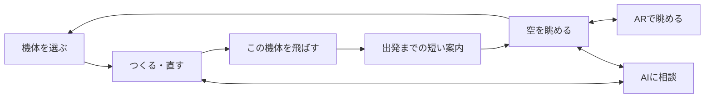

# 会場連携前の充足度レビューと次工程

2026-09-23。コード・現行仕様・公開PC画面の確認に基づく評価。**次のメニュー改善はVRを最優先**とする。今回は調査と仕様整理で、アプリ変更・再デプロイ・有料AI呼び出しは行っていない。

## 結論

原点の「旅客機を見上げ、姿から遅れて届く音を楽しむ」と、作成・クラウド保存・共有飛行の骨格はつながった。利用者からも楽しさの実機報告がある。一方、VRの操作の統一、音と会話の共存、音の形の表現まで完成したとは扱わない。

次は **VRで一巡できる操作の仕上げ → 音の体験とJev運営補助の小さな追加 → 会場案内の最小版**。モデルの全面作り直しや厳密な飛行物理を会場版の前提にはしない。

### 評価の根拠と限界

- 原資料の読解記録：[資料の理解](source-analysis.md)。原資料は基礎であり、後のユーザー判断を優先する。
- 現行の優先順：[原点の基準](core-experience-baseline.md)、[音の品質方針](core-quality-reset.md)、[アイデア記録](idea-notes.md)。一機に見惚れる → 持ち寄った機体 → 会場の順。
- 実装：`SharedApp.tsx`、`XrWorkbench.ts`、`shared-panel.ts`、`vr.ts`、`ui/shared-control-surface.ts`、`audio.ts`、`space-sound.ts`、`Scene.tsx`、coreの飛行・到来・共有処理、AI Worker。
- 今回は公開PC画面を実際に操作・撮影。VRはコードの構成を確認した。**Questでの今回の実機確認、聴感評価、実音声AIとの会話試験はしていない。**
- 直前リリースの210件の単体テスト、模擬XRの確認は[実装記録](menu-and-voice-2026-09-23.md)を参照する。今回の新しい実機合格として数えない。

## 1. コンセプトと実装の充足度

| 体験・要件 | 現状 | 残ること |
|---|---|---|
| 一機の大きさ・頭上通過・見上げる体験 | 実寸の基準と滑らかな飛行がある。ユーザーの肯定的な体験報告あり | 高度・視点・姿勢で存在感が維持されるか。モデル全面改修より基準フライトを優先 |
| 姿と音の到来のずれ | 発音履歴、過去位置からの到来、距離と向きによる音の変化あり | Questスピーカーで接近→通過→余韻を再確認 |
| 旅客機らしい重い音 | 深い響きを共通土台に統一。PCはファン・気流などを調整可能 | 音色を大きく増やすより通過感を磨く。今回は聴感の合否をつけない |
| 音が形・厚み・硬さとして感じられる | 到来と結びつく軌跡・波紋、機体と視線上で重なる部分の減衰あり | 周波数帯や音の包絡に応じた厚み・密度・余韻は未実装。機体を隠さない小さな比較試作が必要 |
| 作る→保存→呼ぶ→飛ばす | PC/VRの編集・名前入力・クラウド格納庫・同じ空へ接続済み | VRで各画面をまたいだ言葉・配置・戻り先を統一 |
| みんなの機体が飛び交う | 保存24機、同時飛行3機。空きがあれば手動受付から15秒で出発、離陸後2周。共有の継続運行あり | 任意の機数が同時に飛ぶ仕様ではない。満枠時の待ち時間・次便をより分かりやすく |
| VR/AR | モード切替、手元模型、手・コントローラーの操作基盤あり | モードをまたぐメニュー一巡と配置の実機確認 |
| 操作音・環境音 | 短い押下音・開閉音、任意の風音あり | 保存成功・受付・失敗の音の役割整理。環境音・機体音・AI音声を一緒に聴いた調整 |
| GPTライブ | 機体名・格納庫・現在のメニューを渡し、呼び出し・可逆な編集・ボタン案内につながる | 実会話の聞き取り、名前の取り違え、指操作との競合を実機で確認 |
| Jev | 状態から注目点を選び、案内候補とGPTライブの文脈へ渡す | 出発順・間隔・航路を判断して運行へ反映する機能は未実装 |
| 会場連携 | 机の位置合わせ、座標付き地点、縮小地図の土台あり | 実会場地図・ブース情報・MCPとの対応付け、目的地への案内フローと現地確認 |

## 2. VRメニューを最優先で仕上げる

### 既にあるもの

- 制作画面は形・尾翼の色・音・名前・AI相談に分かれる。
- 制作とホームには「この機体を飛ばす」の主操作がある。
- メニューを閉じる／手元へ呼ぶ、左右の取っ手で位置を調整する仕組みがある。
- 入力方式や飛行段階の変化による勝手な再配置は直前リリースで修正した。
- 未保存の切替確認、AIによる対象の強調、VR内の名前キーボードがある。

### コードから分かった不統一

1. **主操作・戻る・設定の強弱が全ページで揃っていない。** 制作は役割を指定するが、飛行中一覧やAIページには同形のボタンが並ぶ。描画側も`navigation`と通常選択の違いは十分ではない。
2. **AIページの戻り位置が固定されていない。** 接続準備ボタンの有無で並びが変わり、会話・マイク・制作・戻る・Jevが同列に置かれる。
3. **ホームの選択肢が多い。** 飛ばす、編集、新規、保存機体、AI、飛行中、設定、AR、ブラウザ退出が同時に表示される。飛ばす強調だけで、初見の迷いが解消したとは言えない。
4. **状態の説明が長い。** 名前、保存状態、GPTライブ、Jev、接続、飛行状態が混在する画面がある。装着中に読む量を減らす余地がある。

上記はコード構成の指摘。文字の読める距離、手が届くか、画面外へ外れた盤を見つけられるかは実機評価が必要。

### 次のVR仕様案（未実装）

- **編集時**：正面に模型、横に編集盤。選択肢は大きく、最も強いボタンは一つ。保存状態を短く出す。
- **観察時**：大きな盤を閉じる動線を明示し、小さな呼び出し口を残す。AIの更新や飛行開始で盤を勝手に移動しない。
- **全ページ共通**：同じ位置に「○○へ戻る」「閉じて眺める」。設定の選択肢と見た目を分ける。
- **AR切替**：共通の場所に置き、現在がVRかARかを短く示す。ブラウザ退出は終了操作として分離する。
- **AI案内**：いま見えている一つのボタンを縁・ラベル・短文で示す。色だけに依存しない。本人の手操作を優先し、古い案内は消す。
- **名前付き機体の一覧**：対象名と飛行中／待ち／保存だけの状態を分ける。機体名が長い場合も見分けられる表示を用意する。
- **操作音**：押す・決定・受付・注意が分かればよい。常時鳴らしたり、通過音を覆う長い演出にはしない。

### VRの完了条件

Quest 3一台、手操作を主に、音声なしでも次を一巡できること。

1. 保存機体を名前で選ぶ → 色か形を変える → 保存する。
2. 飛ばす → 待ちの状態が分かる → 盤を閉じて通過を見る。
3. 盤を呼ぶ → ARへ切り替える → VRへ戻る → 格納庫へ戻る。
4. 左右の取っ手で移動し、手を離すと固定。頭を動かす・手を見失う・飛行開始でも飛ばない。
5. AIを使う場合も同じ場所が光り、名前と対象が一致する。会話終了・マイク停止が見つかる。

初見の人が運営の指差し説明を繰り返し必要とする場合、手順は通っていてもUXの合格にしない。疲れ・距離・文字サイズはQuestで判断する。

## 3. 音の仕上げは「増やす」より「共存させる」

現行の`space-sound.ts`は押下と開閉の二種類の短い合成音と、任意の風音。基礎はあるが、音による操作状態の説明や、会話との音量調整まで完成していない。GPTライブの音声再生と機体音を連動させて一時的に音量を下げる処理は、今回確認した経路にない。

次の小さな仕上げ案：

- 通過する機体の音を主役として、操作音は短く小さくする。
- 保存・出発受付には短い確定音と文字表示、失敗には異なる短音と理由。音だけで状態を伝えない。
- 会話開始中は環境音・操作音を控え、必要なら機体音も少し下げ、会話後にゆっくり戻す。下げ幅は実機で比較する。
- 一機の接近→頭上→通過後の余韻、三機とAI音声の同時再生をQuest本体スピーカーで聴き比べる。
- 音の形は一つの表現から：到来時に薄い軌跡へわずかな厚みを出し、消え方と一緒に比較。派手な波紋を増やすことを目標にしない。

## 4. 会場前のJev追加：静かな運営補助

### 今のJev

`workers/ai-trial.ts`は、観察オンかつ端末から新しい状態が届く間、最短10秒間隔で候補から注目点を選ぶ。名前・距離・接近/遠ざかり・音の信号・遅延中の音などを利用し、候補外の事実を作らない構成。結果は操作案内の候補や、接続中のGPTライブの文脈へ渡す。

**飛行管制による自動調整、衝突予測、常時の視界理解ではない。** カメラの向き・視野内判定・機体間の接近予測などは追加が必要。信号レベルを人間の聴感測定と同一視しない。

TypeSafeの[公式仕様](https://docs.typesafe.ai/introduction)は状態に対するChoice / Score / Noulの構造化判断を提供する。ここでは範囲を定めた候補の選択に使う。

### おすすめの最小追加

**「今の飛行を邪魔せず、次の一機を提案する」**。

| 分担 | 内容 |
|---|---|
| コードで確定する情報 | 空き枠、出発待ち、最後に飛んだ時刻、待ち時間、経路上の位置・速度、予測される近接、音の重なりの指標 |
| Jevが選ぶもの | 現状維持／次の機体候補／少し待つ候補／注目点を案内、の有限な選択肢と理由 |
| GPTライブ | その理由を利用者の名前・いま見える画面に結びつけ、必要なとき短く説明 |
| 利用者・運営 | 提案を採用。自動運行を入れる場合も運営が明示的に有効にする |
| 飛行エンジン | 受け付けた設定を検証して実行。AIが止まっても既存の規則で飛行を継続 |

「3機が埋まっているから4機目を入れない」は既存の規則で十分。Jevには、その範囲内で何を見せると楽しそうか、どの待ち方が自然かを担当させる。毎フレームの制御や瞬間的な衝突回避は任せない。

### 実装場所と段階

1. **core**：運行情報と許可された候補を生成。時刻・部屋の版・対象IDを付け、確定値と推定値を分ける。
2. **Worker / 共有部屋**：部屋に一つの運営判断を置く。各端末のJevが別々に同じ便を変更しない。古い応答・重複応答を無効化する。
3. **VR/PC**：提案を短いカードで表示。飛行中はメニューを強制的に開かない。採用・見送りを用意する。
4. **GPTライブ**：現在有効な提案だけを説明。採用されていないものを実施済みと言わない。
5. **後続**：提案のログで有効性を見た後、運営オンの範囲内で出発間隔だけ自動調整する。機体の造形・名前・音・飛行中の経路を勝手に書き換えない。

開始・終了・待ち行列変更などのイベントを主な起点にし、変化がない時間の問い合わせを減らす。現在の10秒間隔は端末ごとの観察であり、そのまま部屋の自動運営へ転用しない。呼び出し回数と遅延を記録して費用を見積もる。

## 5. 会場連携への進め方

| 段階 | 完了条件 |
|---|---|
| A：VR操作と音の仕上げ | 上記の一巡をQuestで迷わず行える。音の主役が機体に残る。修正した盤の固定を実機確認 |
| B：Jev運営補助の小さな試作 | 部屋に一つの提案、事実に合う説明、古い提案の破棄、AI停止時の継続を確認 |
| C：会場案内の最小版 | 実地図の少数地点を登録 → 机に位置合わせ → 行き先を選ぶ → その方向へ機体が案内し、説明が一致 |
| D：会場MCP・音声対話の拡張 | 実在するブース情報を取得し、登録地点へ対応付け。利用者が行き先を決める |

Bを大きな自律管制に育て切ることはCの開始条件ではない。会場情報の準備は先行できる。初版はPC＋Quest 3一台で、1〜4地点の現行土台を使う。現在の会場座標は±25mなどの試作用制限があり、実地図に合わせた見直しは別途必要。

## 6. 公開PC画面の補足監査

VRの優先度を下げるものではない。以下は今回取得した約1000px幅のPCブラウザ画面。VRの立体的な見え方の証拠には使わない。公開の保存内容・飛行設定は変更せず、メニューの移動だけを行った。

### 1. 格納庫 — 基本導線は通る／表示の区別に課題

- 良い点：保存機体の一覧、模型、編集・飛行のボタンがある。
- 課題：上の画面移動と中央の背景比較の両方に「格納庫」があり、同じ階層に見えやすい。名前が同じ下書きと保存機体も識別が必要。
- アクセシビリティ上のリスク：背景上の薄い説明文のコントラスト。色だけに頼らない選択表示が必要。

### 2. 形の編集 — 場所の分担は明確／呼び出し欄が狭い

- 良い点：左に項目、中央に模型、右に設定、下に保存と飛行。
- 課題：この幅では保存機体の選択欄が狭く、名前が読みづらい。「ひとつ戻す」が画面移動か変更の取消か分かりにくい。
- アクセシビリティ上のリスク：小さな模型操作ボタン、長い名前の見切れ。別解像度やキーボード一巡の合格は未確認。

### 3. 音の編集 — 方針は一致／比較の入口が下に隠れる

- 良い点：深い旅客機音を土台に少し調整する、という現在の方針に一致する。
- 課題：設定が縦に長く、「基準と聴き比べる」が下へ隠れる。聴き比べを主操作として見つけやすくする余地がある。
- 限界：スクリーンショットから音の品質や差を評価していない。

### 4. 空を眺める — 空を広く見られる／AI列の常設は再検討

- 良い点：飛行中の名前、音の開始、音量が見える。編集より空が広い。
- 課題：AI操作列が目立って残る。観察中は必要時だけ開く考え方が合う。
- 限界：この瞬間の一枚で機体の見つけやすさ、速度、トラッキング、Questの読みやすさは判定しない。

画面確認中のログにはThree.jsのClock非推奨とシェーダー精度の警告があった。今回のメニュー移動を止めるエラーは確認していないが、全エラーがないことの証明ではない。WCAG準拠や実機での快適性の認定も行っていない。
