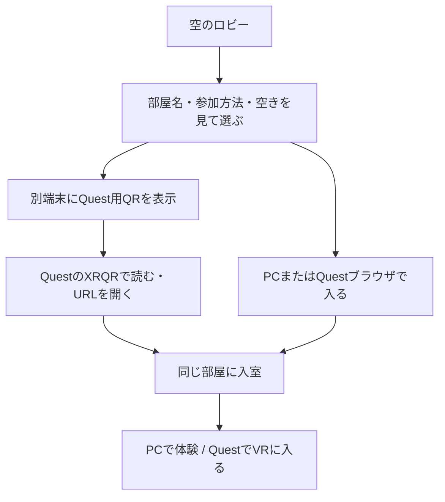

# 空の入口 — 展示会の直接入場と、サービスの部屋一覧

更新: 2026-09-18 / 現行v0.11.0のコードに合わせて棚卸し。v0.9.0で展示入口を初回実装。公開・実機確認の結果は[進捗](progress-overview.md)に記録。

## v0.9.0で使える展示入口

1. 運営が共有版を開き「展示用の部屋をつくる（8時間）」を押す。
2. 機体・航路を選び「展示の飛行を始める」を押す。同時飛行は1機。音の余韻が終わるとサーバーが次の便を開始する。
3. 「展示のQR・編集者の招待」を開き、「来場者（観覧のみ）」のQRを渡す。来場者は「Questで体験をはじめる」から入る。PCでは「この画面で体験する」。
4. 操作盤を閉じて眺め、必要なときだけ側面のグリップで呼び戻す。音量・表示切り替えは自分だけに反映する。
5. 運営が設定を変更すると次の便へ反映。「繰り返しを止める」で現在の便まで飛び、次を自動開始しなくなる。

QRは**その部屋の作成から8時間、同じ入口として再利用**できる。翌日や別の部屋へ引き継ぐ恒久URLではない。部屋終了後は新規作成・QRの差し替えが必要。運営の再読み込みでも同じ観覧用QRを再表示できる。QR画像のダウンロード、印刷用レイアウト、固定ロビー、部屋一覧は後続。

「運営（飛行を編集できる）」を選ぶと編集者用URL／QRになる。通常の共同制作の部屋は従来どおり1時間、参加者全員が編集できる。どちらも同時接続4台まで。展示部屋の観覧権限はサーバーで判定し、URLの`visit`を消しても編集できない。新しいログインアカウントや会場校正の管理権限は追加していない。

来場者交代時の自動初期化、長時間装着解除からの復帰、初見の日本語案内の理解度は実機検証を残す。以下はこの初回実装を含む、将来の設計案。

## 確認できた方向

- ユーザーは、部屋ごとのQR発行、新しい部屋の作成、部屋一覧を希望。
- 一覧の利用者は「参加者も一覧から部屋を選んで入る」と確認済み。
- 追加の意向: QRからURLへ移る操作自体が難しい。サービスとして複数部屋を持ちつつ、展示会では1つの入口・部屋に絞るか、VR内のロビーから移動したい。入ったらシンプルに見られ、必要ならAIで操作できる体験を目指す。
- PCとQuestの両方から作り、同じ飛行を見る方針を維持する。
- 以下の公開範囲・権限・運営手順は開発側の提案。採用済みの仕様とは分ける。

## 展示会の優先フロー — 入ったら飛行が見える

初回のおすすめは、**運営が準備した1つの空へ直接入る方式**。サービス全体の部屋一覧は残す構想とし、展示会の来場者には部屋作成・選択・URLコピー・設定の複製を求めない。前案の「一覧を選び、部屋ごとにQRで移る」を展示会の基本操作から外す。

### 貸し出すQuestの場合

1. 運営が展示入口を開き、機体・航路・繰り返す飛行・音量を準備する。初回の端末許可や接続を確認する。
2. 来場者が装着し、大きな「体験をはじめる」から入る。すでにVRが継続している場合はそのまま眺められることを目指すが、装着し直した際の復帰は実機で確認する。
3. 入室後は飛行を見る・音から探す体験へ直結する。操作盤や設定一覧を最初の主役にしない。
4. 使いたい人だけ簡単な操作や、後続の「案内に話しかける」を利用する。
5. 来場者の交代では端末の音量・注目機・案内表示などを初期状態へ戻す。部屋の飛行を全員分リセットしない。

### 自分のQuestで参加する場合

同じ展示入口を一度開く経路を用意し、その後の体験や部屋移動でURLのコピーを要求しない。QR読み取りからページを開く最初の操作は残り得るため、案内・係員の補助・読み取り統合を別途検証する。現行XRQRを使うだけでこの手間が解消したとは扱わない。

ブラウザのVR開始には利用者の操作・許可が必要で、音も自動再生が制限され得る。「体験をはじめる」へVRと音の開始をまとめる目標とし、許可が必要な初回まで完全な無操作とは約束しない。現行`vr.ts`もクリックから直接`requestSession`を呼んでいる。統合時は音や接続の非同期処理を待ってからVRを要求して操作の有効性を失わないようにする。

根拠: [WebXRの許可と開始条件](https://developer.mozilla.org/en-US/docs/Web/API/WebXR_Device_API/Permissions_and_security) / [音の自動再生](https://developer.mozilla.org/en-US/docs/Web/Media/Guides/Autoplay)

### 複数の空へ広げる場合

**展示入口 → VRへ入る → 空を眺める → 必要ならVR内の行き先から別の部屋へ**を目標にする。ロビー自身も飛行を見られる入口にし、選択だけの空間で立ち止まらせない案。部屋変更のたびのVR終了・ブラウザ遷移・QR読み直しを通常操作にしない。

同じページとXRセッションを保ち、接続先と描画・音の状態を切り替える追加実装が必要。満員・終了・接続失敗の際は今いる空かロビーに留まり、移動先に入れたときだけ切り替える。頭の追跡、音源の停止・再接続、旧部屋の操作権限の破棄も確認する。現在は未実装。

### 同じ部屋のままARで見る

部屋移動とは別に、VR内から今見ている飛行をARへ切り替える希望を追加。同じ便と共有時刻を保ち、その人の背景・表示だけを切り替える。展示会マップを空間に出して地点へ飛ばす案も[ARの2モード](ar-modes.md)へ整理した。AR切り替え時はXRセッションの扱いとブラウザ許可を別途検証し、VR内の部屋移動と同じ処理でできるとは扱わない。

### AIの位置づけ

「今の飛行機を教えて」「もう一度飛ばして」など、少ない言葉で観察や操作を頼める候補。飛行の鑑賞にはAIの応答を待たせず、会場が騒がしい・マイクを使わない・AIが応答しない場合にもボタンで操作できるようにする。LLM・音声認識・音声応答は未接続。

他の参加者にも影響する発進や設定変更は、手動操作と同じサーバー側の権限・競合・予約処理へ通す。個人向けの説明と共有状態の変更を分け、音声要求の再送で便を重複させない。常時しゃべる案内より、求められたときの短い案内を優先する。

## VRと今後のARに共通する日本語の操作案内

2026-09-16、ユーザーが共有・同期の実機成功を報告し、AR／VR中の操作案内と日本語の分かりやすさを重視する意向を表明。v0.9.0では「見え方・操作案内」「ブラウザに戻る」、トリガー／グリップの押す場所、自分だけに反映する操作の案内を追加。以下を品質基準とする。

- ボタンは「何をするか」を短い動詞で示す。「実行」「切替」「終了」だけで結果を推測させない。
- 案内は一度に1つの操作を示す。初回は「ボタンを指して、人差し指のトリガーを押す」のように、押す場所も説明する。必要な場面で再表示できるようにする。
- 自分だけの操作と、全員に影響する操作を区別する。例:「自分の音を止める」「みんなの空に飛ばす」。
- 移動先を明示する。例:「ブラウザへ戻る」「仮想の空に戻る」。ARの候補は「現実の景色に切り替える」に「機体と飛行はそのままです」を添える。
- 接続・処理待ち・失敗では次にできることを示す。例:「接続し直しています。飛行は見られます」「接続できませんでした。もう一度つなぐ」。表示は実際に継続できる状態に限る。
- 空間表示は短い文・読みやすい文字・余白を優先し、PCの長い説明をそのまま貼り付けない。詳しい説明は必要な人が開く。
- PC／VR／ARで同じ操作には同じ名前を使う。ただし単体の一時停止と、共有版の自分だけの休憩など、実際の効果が違う操作は説明も分ける。

初見の人が「次に押す場所」と「結果」を説明なしで判断できるか、Questで確かめる。模擬環境の操作確認を実機での読みやすさの合格とは扱わない。

## 現在できることと追加すること

SharedApp、room-worker、shared-room、room-accessを2026-09-18に照合した。新しい操作部品の試作はこの共有UIへまだ統合されていない。部屋作成は実装済みで、部屋を管理・探すサービスとしてのUIが次の課題。

| 項目 | 現在 | 今回の案 |
| --- | --- | --- |
| 新しい部屋 | 作成画面から作れる | 名前・説明・公開範囲を付ける |
| 部屋専用QR | 入室中の画面で招待URLをQR表示できる | 一覧から対象の部屋のQRを表示する |
| 部屋一覧 | なし | 通常サービスには参加者向け一覧。展示会は指定した空へ直接入る入口を優先 |
| 招待・権限 | 通常は編集招待、展示は観覧／編集用URLを分離。サーバーで判定 | 公開入室・掲載・部屋管理・会場管理の権限を具体化する |
| 参加・復帰 | 招待URLで同じ部屋へ再接続できる | 一覧からも入室でき、終了・満員を案内する |
| 有効期間 | 通常1時間／展示8時間。期限付き保存 | 固定入口から開催中の部屋へ案内。作品・会場の保存期間を部屋の寿命から分ける |
| 継続飛行 | 展示部屋でサーバーが次便を開始 | 来場者交代時の個人設定の初期化と長時間復帰 |
| VR内の部屋移動 | なし | 旧部屋を片付けて別の空へ移動。失敗時にも戻れる流れ |

現在は同時接続4本、サービス全体で24時間に24部屋、同じ接続元から10分で4部屋まで。これはアプリ側の試作用制限で、Cloudflareの契約上限ではない。参加者へ広く開く前に見直しが必要。

## 通常サービスの操作フロー案

### 部屋を準備する人

1. 「部屋をつくる」で機体・航路の初期設定を用意する。
2. 部屋名、短い説明、公開範囲を決める。
3. 「ロビーに掲載」すると参加者の一覧へ表示される。招待限定なら掲載しない。
4. 部屋専用QRをPC画面などに出し、参加者を迎える。
5. 部屋の中で設定を編集し、繰り返し飛ばす。来場者や便が替わるたびに部屋を作り直す必要はない。
6. 終了時は、必要な設定を書き出してから部屋を終了する。

初回は準備する人が作成・公開し、参加者は選んで入る運用を提案する。誰でも公開部屋を作れる運用、作成者のログイン・別端末からの管理復帰は未決定。

### 参加者

- Questブラウザでロビーを開いている場合は、直接選べる。自分の画面のQRを読む操作は挟まない。
- 飛行中の部屋へ途中参加したら、その時点の飛行へ合流する。
- PC／Questブラウザの一覧は通常サービスの入口。VRでの部屋変更は上記のVR内移動を目標とし、「VR終了 → ブラウザで選択 → VR再入場」は復旧時の予備手段に留める。
- 自分の退室・VR終了と、全員に影響する「部屋を終了」は別の操作にする。

## 一覧で伝えること

| 表示 | 内容 |
| --- | --- |
| 部屋名・短い説明 | 例:「夕方の四発機」「一緒に機体をつくる」。何を体験できるか分かる |
| 参加方法 | 「観覧」「共同制作」を表示し、入室時の実際の権限と一致させる |
| 状態 | 入室可 / 飛行中・途中参加可 / 満員 / 終了 |
| 接続数・残り時間 | 現行では人数ではなく接続台数相当。複数タブ・再接続で重なることがある |
| 操作 | 「入る」「Quest用QR」。管理操作は作成者へ分ける |

一覧の空きは参考表示とし、実際の入室時にも上限と期限を確認する。満員なら自動で別の部屋を作らず、更新・ロビーへ戻る操作を出す。終了した部屋のURLでも理由を表示してロビーへ戻れるようにする。

既存の招待限定部屋を自動で公開しない。「観察」モードを追加する際はサーバーでも編集を拒否する必要があり、ボタンを隠すだけで観察専用とは扱わない。

## QRは準備・配布の手段にする

| QR | 行き先 | 運用 |
| --- | --- | --- |
| 展示入口QR | 運営が指定した1つの空。将来はVR内ロビーにも対応 | 固定URLを掲示。貸出機では運営が事前に開き、来場者に毎回読み取らせない |
| 通常サービスのロビーQR | 現在参加できる部屋の一覧 | 複数部屋から選ぶ通常の入口として配布 |
| 部屋専用QR | 特定の部屋 | PC画面などに表示して直接招待。部屋の終了後は入れない |

固定入口は、内部の部屋IDが替わっても同じ場所から体験を始められる仕組みとして設計する。管理側が展示入口と開催中の部屋の対応を設定し、来場者には技術的な部屋IDを見せない。これは部屋の長期保存とは別の機能で、現在は未実装。

現在の1時間の部屋を作り直すだけでは、既に入室している人は次へ移れない。初回展示では体験中に期限切れを起こさない運用時間・有効期間を決める。部屋の切り替えや再接続が必要なときはVR内で短く状況を伝え、再入室の簡単な操作を出す。参加者の入室ごとに別々の部屋を作らず、同じ開催中の空へ接続する。

別グループや別の空を独立して試したい場合に新しい部屋を作る。「設定を引き継いで新規作成」を追加するなら、機体・航路の設定を複製し、参加者・招待鍵・進行中の時刻は引き継がない。

## XRQRの役割

QR生成は現在のAirplanevoiceの`qrcode`で行い、Questでの読み取りにはXRQRを使える。XRQRのコードを取り込まなくても、この役割分担で部屋専用QRとロビー入口QRを用意できる。

XRQRの公開ソースでは通常のURL文字列を扱い、コピー後の「ブラウザで開く」からURLを開く処理を確認。XRQRの読み取り履歴と、Airplanevoiceの開催中の部屋一覧は別のデータとして扱う。部屋の存在・公開範囲・権限・有効期限はAirplanevoice側で管理する。

読み取り画面のアプリ内統合は初回アクセスを減らす後続候補。採用時にライセンス表示、カメラの許可、ブラウザからVRへ入る流れを確認する。体験中の部屋移動はQRを介さずアプリ内で行う方向。今回XRQRサイトの実機再検証はしていない。

確認元: [XRQR README](https://github.com/WebXR-JP/xrqr) / [読み取り文字列の処理](https://github.com/WebXR-JP/xrqr/blob/main/src/utils.ts) / [URLを開く処理](https://github.com/WebXR-JP/xrqr/blob/main/src/screens/ReceiverScreen/components/HistoryCard/index.tsx)

## 実装に進める際の境界

- 現行の`RoomDirectory`は部屋作成の回数制限だけを持ち、一覧用の部屋情報は保存していない。部屋ID・名称・公開範囲・期限・状態などの台帳が必要。
- 一覧取得だけでは各部屋へWebSocket接続しない。表示用の情報を取得し、入室時にその部屋へ接続する。接続数などの更新頻度・期限切れ情報の除去を設計する。
- 一覧のデータには編集用・管理用の秘密鍵を載せない。現在は招待鍵のハッシュだけを保存しているため、元の鍵をサーバーから復元してQRを再発行する方式は使えない。
- 公開部屋では公開入室用の入口から必要な権限を発行する設計を追加する。部屋の改名・掲載変更・終了の管理権限は参加者の編集権限と分ける。
- 既存の招待URLを保ちつつ、新しい公開入室の仕組みを設ける。QRの読み取りだけを利用者の本人認証とは扱わない。

## 実装順の提案と確認項目

追加の意向に合わせ、一覧の公開を先に進める案から次の順序へ見直す。

1. **1つの空へ簡単に入る**: 運営の展示準備、固定入口からの入室、「体験をはじめる」、継続する飛行、来場者交代、期限・通信断からの復帰。管理権限と体験操作を分ける。
2. **VR内で別の空を選べる**: 名前付き部屋と公開範囲、通常サービスの一覧、VR内の行き先、移動失敗時の復帰。全体サービスの複数部屋をこの段階で広げる。
3. **簡単な体験操作にAIを加える**: 案内・操作の依頼と手動操作の共通化。音声の許可・遅延・失敗時の操作を含めて検証。読み取り統合は持込Questの初回入場に必要なら別途採用する。

展示の受入目標案:

- 運営準備済みのQuestで、来場者がURL入力・コピー・QR読取・部屋作成・設定複製をせずに体験を始められる。
- 許可取得済みの状態では、アプリ内の開始操作を1つにまとめる。初回のブラウザ許可と、装着し直した際の復帰は別に数える。
- 入室後、飛行や次の通過を認識できる。初回の視認・通過・音の到来までの時間を測り、何も起きない画面で待たせない。新規入室で他の参加者の飛行時刻を巻き戻さない。
- 部屋変更はVR内で完結し、満員や接続失敗でも操作可能な空間が残る。
- AI未使用・無応答でも観察と基本操作を続けられる。

共有の確認は、PCとQuestが同じ部屋へ入ること、許可された参加者が両方から編集・開始できること、満員・終了と競合する入室、退室と全員終了の違い、管理権限を参加者が使えないこと。一覧を追加する段階で公開範囲と既存の非公開招待の継続も確認する。PC自動確認とQuest実機確認を分けて記録する。

進捗: フロー案の整理まで。上記3段階の実装は0/3。既存マルチの実機受入や品質改善の進捗には加算しない。

関連: [共有する空](shared-sky.md) / [公開手順](deployment.md) / [プリセットの受け渡し](sky-transfer.md)
