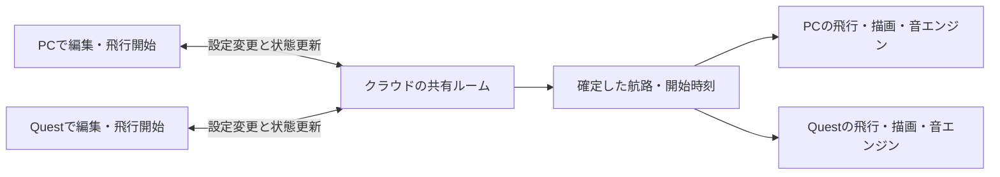

# 同じ空を、PCとQuestから作って飛ばす

更新: 2026-09-16 / v0.8.0で共有機能を追加、現行v0.9.0 / 状態: 旧版のQuest QR・同期は実機確認済み。展示入口・ARは実機確認待ち。

## v0.9.0の追加

- 通常部屋は1時間・共同編集を維持。展示部屋は8時間、編集用／観覧用の鍵を分離する。最大4接続・部屋発行上限は維持。
- 展示の繰り返しはDurable Objectのalarmが進行。音の余韻終了後に最新の下書きから1便だけ生成し、時刻・チェックサムを永続化して通知する。遅延したalarmで過去の便をまとめて発進させない。停止後は期限のalarmのみ残す。
- 観覧キーは編集キーから用途別のSHA-256で導出。サーバーは両キーのハッシュのみ保存し、接続時の役割をWebSocket attachmentに保持。観覧者の編集・発進・予約取消・繰り返し設定はサーバーで拒否。招待URLは権限そのもので、来場者へ編集者用QRを渡さない。
- 既存部屋は追加の観覧権限なしで動く。プロトコル名と既存状態を維持し、テーブルの追加で対応。新しいログインやDBサービスは導入しない。
- 詳細と運営手順は[展示入口](room-lobby-flow.md)、ARの方式と限界は[ARの2モード](ar-modes.md)。以下の初回試作の記録に、この追加が優先する。

## 今回確認した方向

- 優先は、クラウドを介して複数人・複数端末から作って飛ばすVR体験。PCとVRの両方が操作側になる。
- 最初の端末構成は、ユーザーの回答により **PC＋Quest 3、両方から操作**。
- 旅客機が飛ぶ姿を地上から見上げる原点を保ち、作成・試遊を一緒に行う。ドームは表現の候補として保留する。
- 飛行の成立条件と機体同士の調整はエンジンが担う。LLMの生成待ちを飛行・共同操作の前提にしない。

ユーザーがCloudflareを無料範囲で使う方針と配置先アカウントを指定。対象アカウントのWorkers Freeを管理画面で確認した。初回はWorkersでアプリとAPIを同じURLから配信し、SQLite型Durable Objectsで共有する。全製品の本番構成や有料運用を決めたものではない。

## 最初に試す体験

1ルーム・2端末・同時に飛ぶ旅客機1機から検証する。最終的な機数・参加人数の上限を1機・2人に決めるものではない。

1. PCで部屋を開き、招待URL／QRをQuestへ渡す。
2. 両方に同じ機体と編集中の航路が見える。PCはマウス、VRは空間の操作盤・レイで機体のパターン、航路の2地点、高度、速度を変更できる。
3. どちらかが「飛ばす」を押すと、共有された時刻で同じ旅客機が飛び始める。両者はそれぞれの場所から見上げ、頭の向きに応じた音を聴く。
4. 飛行中も次の設定を編集できる。次の便を予約し、今の飛行を急に書き換えずに次の試遊へつなげる。
5. 一人が休憩・退出しても相手の飛行は続く。戻ると現在の飛行へ合流する。

PC担当と観察専用のQuest担当に固定しない。同じ編集対象と操作結果を共有し、入力方法を端末に合わせる。全文JSONやすべての細かなパラメーターをVR操作へ移すことは初回条件にしない。

## 共有の仕組み

クラウドは部屋の正しい状態と操作の順序を管理する。各端末は確定した同じ飛行予定と共通時刻から機体位置を計算する。頭の向きに合わせた映像・音声をクラウドから配信する方式は、今回の基本案にしない。

| 状態 | 管理する場所 | 扱い |
| --- | --- | --- |
| 編集中の機体・航路、変更の版番号 | ルーム | PC／VRで同じ設定を編集 |
| 実行中の飛行と予約した次の便 | ルーム | 実行用の設定は確定後固定。下書きと分ける |
| 便ID、開始時刻、航路のチェックサム、エンジンの版 | ルーム→各端末 | 一致しない端末は同期済みと表示しない |
| 接続台数 | ルーム→各端末 | 初回は台数を表示。編集者名・対象のリアルタイム表示は後続 |
| 位置・向き・音の到来、注目機、音量 | 各端末 | 同じ飛行でも観察位置により聞こえ方は異なる |
| 残したい機体・航路の設定 | ルーム内保存＋JSON書出 | ルームは1時間で終了。作品ギャラリーや利用者DBは後続 |

### 同時編集と適用

- 操作に、対象ID・元の版番号・重複防止の操作IDを付ける。サーバーで検証・確定し、確定結果を両方へ配る。
- 初回は設定全体の版番号で競合を検出する。先に届いた有効な編集を確定し、古い版の編集は理由を返して最新状態を表示する。別の対象でも同時変更は競合する。対象単位の編集権は後続候補。
- PCは地図でA／Bを置き、VRは選択した地点を東西南北へ100m単位で動かす。反映待ち中は追加編集を止め、毎描画フレームのDB書き込みを避ける。
- 飛行開始はサーバーが少し先の時刻を決める。受信が遅れた端末は開始から再生し直さず、その時刻の機体へ追いつく。
- 共有時計は端末の時計のずれと通信往復時間を測って補正する。急な時計修正で機体を前後させない方法を検証する。

### 飛行中の編集、休憩、復帰

- `draft`（編集）、`activeFlight`（飛行中）、`queuedFlight`（次便）を分ける。次便の予約後に下書きを変えても、予約済みの便へ勝手に反映しない。
- 初回の単機案では次便の開始を先行便終了後に調整する。音の余韻を残す間隔は試遊で決める。
- 個人の休憩はその端末の音を止める操作。機体と共有時間は進む。全体を止める操作は初回に含めない。
- 再接続は最新の設定・実行中の便・時刻から復帰し、切断中の編集を自動で上書き送信しない。過ぎた音をまとめて鳴らさない。
- 通信断では最後に受け取った飛行は端末で継続できる構成とし、切断表示と共有編集の保留を行う。復帰後はサーバー状態へ合わせる。
- 初回は同じ仮想空間を共有する。現実の同じ部屋へのAR位置合わせ、アバターや音声通話は別の範囲。

## 各エンジンとLLMの責務

| 担当 | 責務 |
| --- | --- |
| 航路・飛行エンジン | 入力の検証、滑らかな航路、速度・高度・姿勢、時刻からの再現 |
| 空域・運行エンジン | 同時飛行数、開始間隔、将来の機体間距離・航路競合の検証 |
| 共有ルーム | 操作の順序、確定版、開始時刻、参加・復帰、保存 |
| 音・描画エンジン | 各人の位置と頭の向きに応じた音の到来と旅客機の表示 |
| LLM（後続） | 意図の読み取り、設定案、次の行き先や案内の提案。数値の成立判定はエンジンへ渡す |

現行コードには複数機の衝突回避・間隔保証はない。単機の初回試作は、その機能を検証したことにはならない。複数機へ広げるときは、時刻を含む経路の距離を評価し、不成立なら発進時刻の調整や再提案を行う。実航空の運航保証を目標にするものではなく、この仮想体験の条件を具体化する。

LLMは共有操作と飛行とは独立した非同期処理にする。要求ID・対象の版・適用期限を持たせ、待っている間も手動編集と飛行を続けられるようにする。古い版への生成結果は直接適用せず、再提案として扱う。初回応答と提案完成までの時間を別に測り、モデル選定は後続とする。

## 共有基盤の第一候補

**初回試作の採用構成: Cloudflare Workers＋SQLite型Durable Objects。** ルームごとに1つのDurable Objectを置き、WebSocketで双方向に状態を配る。設定・便・版を永続化し、復帰できる。別の管理オブジェクトで部屋の作成数を制限する。D1などの別DBは追加していない。

2026-09-16に公式資料を確認。Durable Objectsは複数クライアントの調整とWebSocketに対応し、休止時も接続を保持できる仕組みがある。この機能を部屋の管理へ当てはめる設計判断であり、本アプリでの実測結果ではない。[WebSocket公式資料](https://developers.cloudflare.com/durable-objects/best-practices/websockets/)

SQLite型はWorkers Freeでも利用できるが、無料枠を超えると該当操作が失敗する。既存アカウントの契約、部屋数・保持期間・通信量を確認するまで「無料運用できる」とは確定しない。[料金公式資料](https://developers.cloudflare.com/durable-objects/platform/pricing/)

共有版はアプリとAPIをCloudflareの同じ`workers.dev` URLから配信する。GitHub Pagesには単体版を残し、共有版への入口を置く。独自ドメインは取得しない。[workers.dev公式資料](https://developers.cloudflare.com/workers/configuration/routing/workers-dev/)

招待URLは設定を埋め込む従来のQRと区別して「進行中の部屋へ入る」入口。初回は編集用招待のみ。URLを知っている人は機体・航路を変更できる。会場配置や管理操作を認可する招待ではない。

### 初回の上限と保存

- 部屋は作成から1時間で終了し、内容を削除。残したい下書きは終了前にJSONで保存する。
- 同時接続は4本まで（2端末と再接続時の重なりを想定）、同時飛行1機＋予約1便。
- サービス全体で24時間に24部屋、同じ接続元から10分で4部屋まで。接続元IPは作成制限のためハッシュ化して保持し、24時間を過ぎた記録は次の作成要求時に削除する。個人識別や利用分析は行わない。
- 接続ごと10秒で60メッセージまで、1メッセージ14,000文字、レシピ12,000文字まで。ユーザー画面のJSONファイルは12,000バイトまで。
- 招待の鍵はURLフラグメントに保持し、WebSocketのプロトコルヘッダーで検証する。DBには鍵のハッシュを保存。ログ・診断出力には招待鍵を含めない。URL／QR自体は編集権限なので、公開配布の範囲を意識する。
- Freeの利用上限はアカウント全体で共有。枠を超える場合は失敗を表示し、有料プランへ自動変更しない。この試作の上限設定は、将来のプラン変更後の請求額を保証するものではない。

## 初回試作の5段階

1. **同じ部屋へ入る**：PCの2ブラウザで状態・版の一致、入退室、保存・復帰を確認。
2. **双方から編集する**：PC／VRの共通操作を作り、同時編集・不正入力・切断中の操作を検証。
3. **同じ飛行を見る**：開始時刻、途中参加、時計のずれ、観察者別の音、個人休憩を確認。
4. **次を作って飛ばす**：飛行中の下書きと次便の予約を分け、二重発進や実行中の設定変更を防ぐ。
5. **クラウド＋実機で試す**：PC＋Quest 3で双方向操作・再接続・音を確認し、通信遅延、位置のずれ、端末の負荷を記録。

PCの複数ブラウザやVR模擬確認を、PC＋Quest実機の成功へ置き換えない。具体的な同期誤差・応答時間の受入値は、初回測定と見え方から設定する。

実装・自動確認の結果は[進捗](progress-overview.md)、起動と配布は[公開手順](deployment.md)を参照。1〜4はコードと模擬環境で確認。5はQuestでQR入室・共有・同期の成功報告を受領し、実機検証が進んだ。個別操作・通信断からの復帰・音・同期誤差と負荷の確認は残る。

## 後続の広がり

- [空の入口・部屋の操作フロー](room-lobby-flow.md)：8時間の展示入口と観覧用QRを追加。恒久入口、部屋一覧・VR内移動、AI操作は後続。
- [ARの2モード](ar-modes.md)：機体のみを現実の周囲へ重ねる基本AR、管理側の測量・校正とMCPを組み合わせる展示会案内。
- 「航空機の声」やキャラクターボイス：旅客機のエンジン音、操縦者・管制・案内キャラの声を別の音源として扱う候補。連携先とLLM・音声APIは未選定・未接続。基盤の試遊後に、説明が飛行音を邪魔しない発話量・優先度を詰める。

関連: [現行方針](project-direction.md) / [進捗](progress-overview.md) / [エンジン](engine-design.md) / [本番環境の相談](production-options.md)
