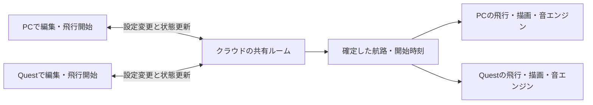

# 同じ空を、PCとQuestから作って飛ばす

更新: 2026-09-16 / 状態: 初回構成を確認し、設計を具体化。共有機能は未実装。

## 今回確認した方向

- 優先は、クラウドを介して複数人・複数端末から作って飛ばすVR体験。PCとVRの両方が操作側になる。
- 最初の端末構成は、ユーザーの回答により **PC＋Quest 3、両方から操作**。
- 旅客機が飛ぶ姿を地上から見上げる原点を保ち、作成・試遊を一緒に行う。ドームは表現の候補として保留する。
- 飛行の成立条件と機体同士の調整はエンジンが担う。LLMの生成待ちを飛行・共同操作の前提にしない。

以下は、この方向を実装へ落とす開発側の設計案。Cloudflareの採用・アカウント・料金プランは未決定で、この整理でクラウド環境を作成したわけではない。

## 最初に試す体験

1ルーム・2端末・同時に飛ぶ旅客機1機から検証する案とする。最終的な機数・参加人数の上限を1機・2人に決めるものではない。

1. PCで部屋を開き、招待URL／QRをQuestへ渡す。
2. 両方に同じ機体と編集中の航路が見える。PCはマウス、VRは空間の操作盤・レイで機体のパターン、航路の2地点、高度、速度を変更できる。
3. どちらかが「飛ばす」を押すと、共有された時刻で同じ旅客機が飛び始める。両者はそれぞれの場所から見上げ、頭の向きに応じた音を聴く。
4. 飛行中も次の設定を編集できる。次の便を予約し、今の飛行を急に書き換えずに次の試遊へつなげる。
5. 一人が休憩・退出しても相手の飛行は続く。戻ると現在の飛行へ合流する。

PC担当と観察専用のQuest担当に固定しない。同じ編集対象と操作結果を共有し、入力方法を端末に合わせる。全文JSONやすべての細かなパラメーターをVR操作へ移すことは初回条件にしない。

## 共有の仕組み

クラウドは部屋の正しい状態と操作の順序を管理する。各端末は確定した同じ飛行予定と共通時刻から機体位置を計算する。頭の向きに合わせた映像・音声をクラウドから配信する方式は、今回の基本案にしない。

| 状態 | 管理する場所 | 扱い |
| --- | --- | --- |
| 編集中の機体・航路、変更の版番号 | ルーム | PC／VRで同じ設定を編集 |
| 実行中の飛行と予約した次の便 | ルーム | 実行用の設定は確定後固定。下書きと分ける |
| 便ID、開始時刻、航路のチェックサム、エンジンの版 | ルーム→各端末 | 一致しない端末は同期済みと表示しない |
| 編集中の人、編集中の対象 | ルーム→各端末 | 誰がどこを動かしているかを短く示す |
| 位置・向き・音の到来、注目機、音量 | 各端末 | 同じ飛行でも観察位置により聞こえ方は異なる |
| 残したい機体・航路の設定 | 初回はルーム内保存＋JSON書出を候補 | 作品ギャラリーや利用者DBは後続 |

### 同時編集と適用

- 操作に、対象ID・元の版番号・重複防止の操作IDを付ける。サーバーで検証・確定し、確定結果を両方へ配る。
- 同じ地点を同時に動かす場合は、対象単位の短い編集権を候補にする。切断・期限切れで解放し、相手の変更を無言で上書きしない。別の対象は並行して編集できる設計を目指す。
- 手元のドラッグ表示はすぐ動かし、共有への確定待ちを示す。編集中の位置の通知頻度と永続保存の頻度を分け、毎描画フレームのDB書き込みを避ける。
- 飛行開始はサーバーが少し先の時刻を決める。受信が遅れた端末は開始から再生し直さず、その時刻の機体へ追いつく。
- 共有時計は端末の時計のずれと通信往復時間を測って補正する。急な時計修正で機体を前後させない方法を検証する。

### 飛行中の編集、休憩、復帰

- `draft`（編集）、`activeFlight`（飛行中）、`queuedFlight`（次便）を分ける。次便の予約後に下書きを変えても、予約済みの便へ勝手に反映しない。
- 初回の単機案では次便の開始を先行便終了後に調整する。音の余韻を残す間隔は試遊で決める。
- 個人の休憩はその端末の表示・音の休憩。共有時間は進む。全体を止める操作は別に明示する。
- 再接続は最新の設定・実行中の便・時刻から復帰し、切断中の編集を自動で上書き送信しない。過ぎた音をまとめて鳴らさない。
- 通信断では最後に受け取った飛行は端末で継続できる構成とし、切断表示と共有編集の保留を行う。復帰後はサーバー状態へ合わせる。
- 初回は同じ仮想空間を共有する。現実の同じ部屋へのAR位置合わせ、アバターや音声通話は別の範囲。

## 各エンジンとLLMの責務

| 担当 | 責務 |
| --- | --- |
| 航路・飛行エンジン | 入力の検証、滑らかな航路、速度・高度・姿勢、時刻からの再現 |
| 空域・運行エンジン | 同時飛行数、開始間隔、将来の機体間距離・航路競合の検証 |
| 共有ルーム | 操作の順序、確定版、開始時刻、参加・復帰、保存 |
| 音・描画エンジン | 各人の位置と頭の向きに応じた音の到来と旅客機の表示 |
| LLM（後続） | 意図の読み取り、設定案、次の行き先や案内の提案。数値の成立判定はエンジンへ渡す |

現行コードには複数機の衝突回避・間隔保証はない。単機の初回試作は、その機能を検証したことにはならない。複数機へ広げるときは、時刻を含む経路の距離を評価し、不成立なら発進時刻の調整や再提案を行う。実航空の運航保証を目標にするものではなく、この仮想体験の条件を具体化する。

LLMは共有操作と飛行とは独立した非同期処理にする。要求ID・対象の版・適用期限を持たせ、待っている間も手動編集と飛行を続けられるようにする。古い版への生成結果は直接適用せず、再提案として扱う。初回応答と提案完成までの時間を別に測り、モデル選定は後続とする。

## 共有基盤の第一候補

**開発側の推奨案: Cloudflare Workers＋SQLite型Durable Objects。** ルームごとに1つのDurable Objectを置き、WebSocketで双方向に状態を配る。設定・便・版は永続化し、復帰できる形にする。D1などの別DBは初回のルーム保存には必須としない。

2026-09-16に公式資料を確認。Durable Objectsは複数クライアントの調整とWebSocketに対応し、休止時も接続を保持できる仕組みがある。この機能を部屋の管理へ当てはめる設計判断であり、本アプリでの実測結果ではない。[WebSocket公式資料](https://developers.cloudflare.com/durable-objects/best-practices/websockets/)

SQLite型はWorkers Freeでも利用できるが、無料枠を超えると該当操作が失敗する。既存アカウントの契約、部屋数・保持期間・通信量を確認するまで「無料運用できる」とは確定しない。[料金公式資料](https://developers.cloudflare.com/durable-objects/platform/pricing/)

試作は既存GitHub Pagesのアプリから共有APIへ接続する案がある。Workerには独自ドメインなしで`workers.dev` URLを使える。アプリ配信もCloudflareへまとめるかは別途判断する。[workers.dev公式資料](https://developers.cloudflare.com/workers/configuration/routing/workers-dev/)

招待URLは設定を埋め込む従来のQRと区別して「進行中の部屋へ入る」入口にする。編集できる招待と閲覧専用の区分、部屋の期限、接続数・メッセージ量・入力サイズの上限は公開前に決める。初回試作では編集用招待を両端末へ渡す。

## 現行コードとの差

- 航路・姿勢・音の計算とレシピの検証は既に分離されており、共通予定の再現へ利用できる。
- `Experience.start()`は端末の時計から2.5秒後に発進し、`edit()`は飛行を終了する。共有開始時刻の注入、途中参加、飛行と下書きの分離が必要。
- VRは現状、飛行開始・休憩・機体選択・音の調整が中心。航路を作るVR操作は追加が必要。
- `ArrivalQueue`は発音の消費履歴を持つ。途中参加時の履歴初期化と、復帰時に古い音を一斉再生しない処理を検証する。
- 現行QRは設定のコピー。部屋の状態・変更・共通時計を配る通信はまだ存在しない。

## 初回試作の5段階案（実装0/5）

1. **同じ部屋へ入る**：PCの2ブラウザで状態・版の一致、入退室、保存・復帰を確認。
2. **双方から編集する**：PC／VRの共通操作を作り、同時編集・不正入力・切断中の操作を検証。
3. **同じ飛行を見る**：開始時刻、途中参加、時計のずれ、観察者別の音、個人休憩を確認。
4. **次を作って飛ばす**：飛行中の下書きと次便の予約を分け、二重発進や実行中の設定変更を防ぐ。
5. **クラウド＋実機で試す**：PC＋Quest 3で双方向操作・再接続・音を確認し、通信遅延、位置のずれ、端末の負荷を記録。

PCの複数ブラウザやVR模擬確認を、PC＋Quest実機の成功へ置き換えない。具体的な同期誤差・応答時間の受入値は、初回測定と見え方から設定する。

関連: [現行方針](project-direction.md) / [進捗](progress-overview.md) / [エンジン](engine-design.md) / [本番環境の相談](production-options.md)
