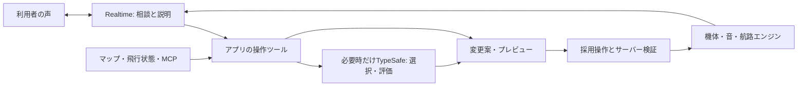

# TypeSafe / Jevをどこに入れるか

2026-09-18 / **接続アダプターと模擬試験まで。実API・マイク・音声合成・公開サービスには未接続。**

## 今回の判断

### 最新：GPT-Liveは人のアシスト、TypeSafeは独立した飛行観察

ユーザーの補足により、**会話の時間と、飛行状況を観察する時間を分ける**。GPT-Liveを人の相談・操作案内の窓口とし、TypeSafeは会話がない間も飛行・音・次便の状況を判断する役にする。最新の仕様・料金は[AI管制官の設計](ai-guide-spec.md)を正とする。以下のRealtime中心の案は比較の経緯。

- アプリが現在の事実と短いイベント履歴を作り、TypeSafeが注目する出来事・次便の候補・待つ判断を選ぶ。TypeSafe自身が自由な文章で実況やログ要約を生成するわけではない。
- 初回案は飛行中10秒間隔＋変化時。最短5秒、同時1件、最新状態へまとめる。共有空間は部屋ごとに1つの観察処理とし、端末数で同じ推論を増やさない。空間終了・無人・状態の途絶・予算到達で停止。
- 観察メモをGPT-Liveのclient delegation側から読めるようにする。現在の状態は質問時にも読み直す。短い説明を作る軽量LLMは必要時に使う。操作IDとボタンの案内はローカルでも継続できる。
- 観察ON、解説ON、自動調整ONは別。観察だけで設定を変えず、調整ONでは許可項目・幅・次周等の適用時点をコードで検証する。音声を閉じても観察は続けられる。
- 地図ではMCPの展示情報と登録地点から「どれを紹介／候補にするか」を判断する。座標変換・距離・航路の成立はアプリが計算し、会場測量を推論で代用しない。

1空間8時間、1回1,000入力token・Choice 1回なら、10秒間隔2,880回のTypeSafe推論は約19.35円（1ドル160円の仮定）。5秒間隔なら約38.71円。複数の質問、個別視点、別の空間は追加。声の接続時間と別に計算する。**この観察ループ・Live接続は設計段階で未実装。**

### 2026-09-18追加：エンジン内部の判断にも使ってみる

**新しい実験候補。未実装・実API未実行。** ユーザーから「エンジン部分でもTypeSafeを使ってみる」と補足があった。従来の役割表は出発点とし、TypeSafeを会話の振り分け専用に固定しない。エンジンを構成する「何を選ぶか」の処理を、ルール／TypeSafeで差し替える案を加える。

| 差し替える判断 | TypeSafeへ渡すもの | 返り値から起こす変化 |
| --- | --- | --- |
| 次周の飛び方 | 前の周回、観察位置、変えたい印象、成立する候補 | 高度帯・回り込み・ゆらぎ等の候補を選び、次の航路を作る |
| 音の性格 | 機体設定、飛行状態、利用者の好み、音量等の測定値 | 低域／ファン／空気音の組み合わせを選び、音の設定へ反映する |
| 機体の組み立て | 用意した部品・寸法候補、欲しいシルエット | 翼・エンジン配置等の構成を選び、部品を組み立てる |
| 管制・仮想パイロット | 現在便・予約・会場の地点・指示 | 待機、次の行き先、飛行スタイル、案内の有無を決める |

この構成では、TypeSafeの判断が実際の挙動を変える。人向けの助言に限定するものではない。まず次周の1判断を実験対象とし、単なるシード変更より面白い変化が作れるかを比較する。初回は外部音声モデルを使わなくても試せる。

**適用方式も比較する**：通常の制作は候補を見て採用する方式。別に、利用者が自動変化を有効にした実験では、許可した項目・幅・適用時点の範囲で自動適用する案。すべての判断に確認操作を挟む設計には固定しない。部屋全体への適用は共有サーバーが一度だけ確定し、各Questが別々に推論して飛行を変えない。

モデルの出力は数式の正解や衝突しない航路を保証しない。Choiceは候補、Scoreは記述した段階上の評価、NoulはYesの確率であり、その値を物理量と同一視しない。評価から制御値へ変換するなら対応範囲と変化幅を明示する。音の波形合成・姿勢補間・時計・描画は返答を待たず動かし、判断遅延時は従来方式または最後の有効値を使う。[公式の質問形式](https://docs.typesafe.ai/introduction) / [Score](https://docs.typesafe.ai/primitives/score) / [Noul](https://docs.typesafe.ai/primitives/noul)

実験の入力・モデル版・返答・採用結果・適用時刻を残し、再生では記録した決定を使う。同じ入力を再推論すれば同じ結果になるとは仮定しない。比較項目は変化の自然さ、左右のふらつき、候補の偏り、応答時間p50/p95、費用、2端末の一致、停止・取消・遅延時の復帰。今回の実装は既存の音操作提案アダプターまでで、この差し替え機構はまだ作っていない。

### 2026-09-18追記：Realtimeと併用し、作る相談へ広げる

**実現可能な構成案。音声会話や制作パラメーターのAI操作は未実装。** ユーザーは音量操作だけでなく、機体・音・航路を相談しながら少しずつ調整すること、仮想パイロット・仮想管制官がマップや飛行情報を参照して判断することを希望した。

Realtime APIは音声対話中にfunction toolを呼び、アプリ側の処理結果を受け取れる。その関数の中からTypeSafe HTTP APIを呼べるため、専用の両社間連携機能は必須ではない。サーバー用のsideband接続も提供されている。[Realtime tools](https://developers.openai.com/api/docs/guides/realtime-mcp) / [サーバー側の制御](https://developers.openai.com/api/docs/guides/voice-server-controls?api=realtime)

| 担当 | 引き受けること | 本サービスでの例 |
| --- | --- | --- |
| Realtime | 聞く、相談する、理由を説明する、ツールを選ぶ | 「重厚というのは、低い響きを増やす感じですか？」 |
| TypeSafe（必要なとき） | 定義した候補から選ぶ、観点ごとに評価する | 音の調整先、音の傾向、行き先候補、案内する／待つ |
| 機体・音・航路のエンジン | 数値計算、形状生成、合成、飛行、検証 | 翼幅の変更、低域の調整、滑らかな曲線の計算 |
| 会場情報の取得処理 | 現在のデータを集める | 登録マップやMCPからブース情報を取得 |
| 共有サーバー | 最新状態、権限、変更の適用を管理する | 下書きの版を検査し、次便の設定として受け付ける |

TypeSafe自身が音を聴いたり、世界やMCPを自動で調べ続けたりする設計にはしない。アプリが得た発言・測定値・候補・現在の状態を渡す。Choiceは候補選択、Scoreは説明した評価段階上の値。**Scoreをそのまま翼幅や安全な高度と解釈しない。** 採用する数値への対応と値域はコードで定める。[TypeSafeの質問形式](https://docs.typesafe.ai/introduction) / [Scoreの意味](https://docs.typesafe.ai/primitives/score)



#### 具体的に楽しむ案

- **機体づくり**：「もっと翼がゆったり広がる感じ」→胴体長／翼幅／エンジン数など、既存の変更可能な軸へ整理→小さな変更案→見比べる。新しい3D形状そのものが欲しい場合は別の生成処理を検討する。
- **音づくり**：「もっと重く、でもうるさくしない」→低域・音量などを別の観点として扱う→同じ短いフライバイをA/B試聴→好みを採用する。重さと音量を同じつまみとして扱わない。
- **航路づくり**：「机の向こうから、ゆっくり右へ抜けてほしい」→登録地点・聞き手の座標・許可した速度範囲から候補を作る→曲線と所要時間をエンジンで計算→次便で試す。
- **仮想パイロット**：行き先や飛行スタイルの候補を提案。姿勢・速度の連続計算は飛行エンジンが担当する。
- **仮想管制官**：予定・混雑・依頼を読み、「次の便を案内」「待機を提案」「いまは静かに聴く」を選ぶ。間隔や経路の成立はコードで検証する。

これらは提案段階。現在のTypeSafe接続口は端末内の音の操作候補までで、上記の機体編集・航路生成・状況観察を実装した意味ではない。

#### エージェントとして動かすときのループ

`状態を読む → 必要な判断だけ依頼 → 小さな変更案 → 検証・適用 → 実際の結果を観察`

管制官を利用者の窓口にし、制作の専門役は必要なときだけ呼ぶ案を推奨。役の数だけ常時動くモデルを用意する必要はない。判断を発行するきっかけは利用者の依頼・予約の変更・次便への切替等。毎フレームの推論はしない。複数Questから同じ判断を重複発行せず、部屋側で共有判断をまとめ、表示と音の聞こえ方は端末ごとに処理する。

変更案には対象ID・下書きの版・有効期限・自分だけ／部屋全体の範囲を付ける。「やっぱり戻して」や音声の割り込みが起きたら、古い提案を失効させる。音声再生の停止と、予約済みの変更の取消は別の処理とする。

#### 重複と遅延を避ける

Realtimeにもツール選択能力があるので、同じ意図を両方で毎回判定すると待ち時間と判断の不一致が増える。明確な数値入力や「音量を5%下げる」は既存の関数へ直接渡し、TypeSafeは繰り返し発生する小さな意味判断や候補評価で比較する。スライダーの反応、プレビューの操作、飛行はローカルで直ちに動かす。

採用評価は「Realtimeだけ」と「Realtime＋選択的TypeSafe」で、同じ日本語の依頼を用い、操作完了率・誤った変更率・発話終了から画面更新までのp50/p95・一相談の総費用を測る。TypeSafeのAPI応答が速くても、会話全体が自動的に速くなるとは限らない。

#### GPT-Liveを別候補として検討した記録（現在は冒頭の主案）

以前の候補にはGPT-Live 1も含まれていた。公式仕様では、GPT-Liveは会話を担当し、client delegationで任意のモデル・自作エージェント・サービスへ裏側の作業を渡せる。**会話を続けながら機体や航路の案を準備する**用途に合う構成候補。Realtimeのfunction tool方式と、GPT-Liveのdelegation方式はAPIが異なるため実装を混ぜない。音声セッションとバックエンドの費用も別に測る。[GPT-Live公式概要](https://developers.openai.com/api/docs/guides/live)

初回は単一の会話窓口から「次の設定案を出す→プレビュー→採用／戻す」をつなぐ案。サービス採用、API利用開始、公開版への組み込みは今回決定していない。

採用候補は、来場者の短い言葉を操作候補へ振り分ける役。例えば「もう少し静かにして」→「この端末の音量を下げる」。次に、案内すべきタイミングを選ぶ役を検討する。飛行・慣性・音の伝播・同期時刻は既存エンジンが計算する。

TypeSafeのJevは自由な文章を書くモデルではなく、Choice（選択）、Score（数値評価）、Noul（0〜1の評価）を返すモデル。音声認識、読み上げ、長い会話、3D生成のAPIではない。Aivis Cloud等の音声合成や将来の会話モデルと役割を分けて組み合わせられる。[公式Introduction](https://docs.typesafe.ai/introduction)

提示されたAgent Skillは、**開発するAIにAPIの設計方法を教える資料**。それ自体が来場者向けのAIになるわけではない。公式スキルの「小さな判断に分ける」「確定した計算はコードに残す」「出力を検証する」指針を確認して今回の境界を実装した。端末へのスキルのグローバルインストールはしていない。[Agent Skill](https://docs.typesafe.ai/agent-skill) / [公式SKILL.md](https://raw.githubusercontent.com/typesafe-ai/skills/main/skills/typesafe-ai/SKILL.md)

## 速度・費用：公式情報と未確認を分ける

| 項目 | 2026-09-18に確認した内容 |
| --- | --- |
| 固定モデル | `jev-1.13.0`。動く別名より比較結果を再現しやすい |
| 料金 | 入力100万トークンあたり$0.042、出力は無料 |
| 速度の公称値 | 70〜500ms、提供元の測定。主に米国西海岸からの測定 |
| 自分たちの測定 | **まだ0回**。日本からのネットワーク時間、日本語精度は未確認 |
| 今回のAPI費用 | 実API呼び出し0回 |

料金は[Models & Pricing](https://docs.typesafe.ai/models)、速度と公開状況は[提供元の発表](https://typesafe.ai/blog/introducing-system-one-models-and-jev)を参照。仮に1回1,000入力トークンで1,000回なら$0.042という計算になる。質問文・選択肢も入力に含まれる。実際のトークン量、アクセス条件、価格変更は利用開始時に再確認する。「何百倍速い」は提供元の特定比較であり、本サービスへの保証とは扱わない。

## 作った接続口

- `packages/core/src/ai-intent.ts`：小さな端末状態と発言からChoiceを作る。音量増減・消音・音開始・案内・該当なしの6択。機体生成・共有編集は範囲外。
- `workers/typesafe-intent.ts`：サーバー用HTTPアダプター。キーなしは通信せず既存UIへ戻る。標準1.5秒で打ち切り、課金を重ねる自動再試行をしない。
- 応答は既知の選択肢、確率、合計、モデル版、端末状態の世代を検証。低信頼・不正・古い応答・音の準備中は操作候補を出さない。
- 結果は**提案**。既存操作の自動実行にはまだ接続していない。閾値0.85も暫定値で、正解率の保証ではない。[Confidence](https://docs.typesafe.ai/confidence)
- 公開Workerに有料APIのルートは追加していない。ブラウザへAPIキーを渡さない。部屋のキー、参加URL、位置、会場情報はこの試験では送らない。[HTTP API](https://docs.typesafe.ai/api)

## 手元で試す

リポジトリ直下、Node 22.18以降。通常のボタン操作はAIなしで動く。

```powershell
# 通信なし。送信予定の入力だけを確認
npm run probe:typesafe

# TYPESAFE_API_KEYをローカル環境変数に設定した後、1回だけ実APIを呼ぶ
node scripts/typesafe-probe.mjs --live '--utterance=もう少し静かにして'
```

APIキーはチャットやGitへ貼らず、ローカル環境変数で扱う。試験結果にはキーや生のAPIエラーを出さない。API側の利用開始準備は今回行っていない。

## 次の実測と組み込み

1. 日本語20〜30例：明確な依頼、否定、曖昧、相反する複数依頼、独り言。期待結果を先に決める。
2. 成功率だけでなく、誤操作につながる誤分類、該当なしの率、p50/p95応答時間を記録。返却されたconfidenceをそのまま正解率と呼ばない。
3. 最初は画面に「音量を下げる？」という候補を出し、既存の操作ボタンへつなぐ。
4. 共有版で使う前に、参加権限、1端末の頻度制限、1日の呼び出し上限、費用上限を設ける。
5. 音声認識→この判断→既存操作→結果の短い案内をつなぐ。認識や推論を待つ間も旅客機と空間音は進み続ける。

管制官は「話し続けるキャラ」より、「今は機体の音を聴く時間なので黙る」「迷った人にだけ一言案内する」という判断から入れると、原点の体験に合う。これは次の設計仮説で、今回動いている機能ではない。
