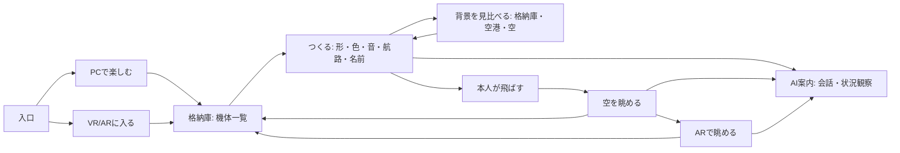

# 空に映える機体をつくる — 統合デザイン方針

2026-09-22 / ユーザー指定を反映。PCの場面分離・背景比較、XRの機体切替確認・AI接続準備・Jev操作を実装。詳細と検証は [実装記録](workbench-implementation.md)。

## 世界観

明るい格納庫と空港、空、白い旅客機。アイボリーと深い青緑を基本に、ゲームのカスタマイズ画面のように編集対象を大きく見せる。主操作だけを強く表示。機体・空・音を隠す過剰な装飾や常時AIチャットを避ける。

- PC編集: concepts/2026-09-22-unified/pc-editor.png
- VR機体切替: concepts/2026-09-22-unified/vr-aircraft-picker.png
- AR制作とAI: concepts/2026-09-22-unified/ar-workspace.png

画像の写実的な機体・光・会場は目標イメージで、現在の実装品質を示さない。UI文字や寸法の最終値は下の仕様を優先する。PC画像の「空」サムネイルは飛行中の空背景へ直し、空港との違いを明確にする。AR模型は見た目の縮尺を併記し、全長71mという実機設計値だけを表示して実寸表示と誤解させない。

## 場所と画面

格納庫・空港・空は背景プレビュー。会場マップは別の体験設定。プレビュー切替が共有世界・他人の視界・飛行中の機体を変更しない。比較時は機体の色と形を維持し、背景差が見える。視点を固定した比較と自由回転を用意する。

## PC

左に制作カテゴリ、中央に大きな機体と環境、右に今選んだ項目の設定。下部に保存・飛行の確定操作。部屋管理・参加者状態は運営側へ分離。

マウス/キーボードで一機の作成・名前入力・試聴・保存・飛行・再編集まで完結する。AI相談は文字入力も扱う設計。貸出Questの空き待ち用の簡略画面に限定しない。

## Questの入口

ブラウザでは「体験をはじめる」を主操作にする。入場後に機体選択・制作・保存・飛行・VR/AR切替・AI会話・Jev観察を扱う。機体変更のたびにブラウザへ戻さない。ユーザー/端末アカウント切替は通常フローへ追加しない。

APIキーや運営秘密情報は空間内にも来場者へも入力させない。既存AIアクセス認証は維持しつつ、運営の事前準備・入場状態の引継ぎを設計する。マイク許可などブラウザが管理するUIは抑止できると約束せず、実機で挙動を確認する。許可できなくても指操作を続けられる。

## 機体切替

3〜4機ずつ、名前とサムネイル、選択マーク、総数/ページを表示。選んだ機体を模型でプレビューし「この機体を使う」で下書きへ呼び出す。ここでは飛行を開始しない。未保存なら「保存して切替 / 保存せず切替 / 続けて編集」を必要時だけ提示。

「機体を使う」「この機体を飛ばす」「注目する機体を変える」は別操作。既に空を飛ぶ機体を勝手に削除・入れ替えない。

## 空間UI

- 制作: 手元の模型と操作パネル。模型とボタンの当たり判定を分離し、同じピンチで二つ動かない。
- 観察: パネルを閉じ、呼出用の小さなバーだけ残す。見上げる視線へ巨大パネルを追従させない。
- AR: 現実の机と足元を遮りすぎない。不透明度は読みやすさを優先。会場キャリブレーションを通常ARの必須工程にしない。
- スケール: 模型は約35〜45cm幅を初期候補、パネルは約50〜65cm幅・約0.6〜0.8m前方を実機調整の出発点とする。確定寸法ではない。飛行中の実機寸法とは別管理。
- 常設の移動とページ内設定の位置・色・大きさを分ける。日本語とアイコンを併記。

## AI

共通の「AI案内」内に、会話と状況観察を独立表示。停止中・接続中・動作中・エラーを明示し、それぞれ終了できる。模型/背景/機体切替でも会話を再生成せず、現在の画面と選択対象だけを更新する。最終的な保存・飛行は本人操作。

今回実装: 運営が入場キーを準備した端末では、XR内の「AIを準備する」から接続を初期化できる。GPT-Liveの会話・ミュートと、Jevの観察開始/停止を別ボタンで扱う。未認証時は事前設定が必要だと表示する。実際の音声接続・マイク許可と手操作の同時動作はQuestの受入確認が必要。

## 実装順

1. PCの格納庫/編集/観察を分離し、同じ下書きと接続状態を引き継ぐ。
2. 背景プレビュー切替をローカル表示状態として追加。空港・格納庫・空の見え方を比べる。
3. Questの機体切替、未保存保護、AIの入口をXR内に統合。
4. 来場者PCとQuestの操作往復を確認し、会場地図・地点登録・手動位置合わせ・地点選択による案内へ進む。

画面装飾の完成を待って会場マップを後回しにしない。最低条件は、どちらの端末でも作成→保存→飛行→別機体へ切替が迷わず通ること。離着陸動作や20機同時飛行は別工程。
